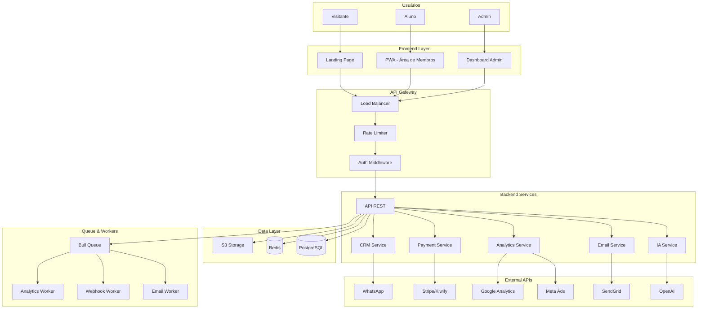

# 🏗️ ARQUITETURA TÉCNICA
## Cetose Consciente - Plataforma de Transformação Nutricional

**Versão:** 1.0  
**Data:** 2026-07-12  
**Status:** 🟢 Documento Fundamental

---

## 📋 ÍNDICE

1. [Visão Geral da Arquitetura](#visão-geral-da-arquitetura)
2. [Stack Tecnológica](#stack-tecnológica)
3. [Módulos da Plataforma](#módulos-da-plataforma)
4. [Modelo de Dados](#modelo-de-dados)
5. [APIs e Integrações](#apis-e-integrações)
6. [Segurança](#segurança)
7. [Performance e Escalabilidade](#performance-e-escalabilidade)
8. [DevOps e Infraestrutura](#devops-e-infraestrutura)

---

## 🎯 VISÃO GERAL DA ARQUITETURA

### Arquitetura de Alto Nível



### Princípios Arquiteturais

1. **Modularidade**
   - Cada módulo é independente
   - Comunicação via APIs bem definidas
   - Fácil manutenção e evolução

2. **Escalabilidade**
   - Horizontal scaling (múltiplas instâncias)
   - Cache inteligente (Redis)
   - CDN para assets estáticos
   - Queue para processamento assíncrono

3. **Segurança**
   - Defense in depth (múltiplas camadas)
   - Least privilege (mínimo privilégio necessário)
   - Zero trust (nunca confie, sempre verifique)

4. **Performance**
   - Response time < 200ms
   - Lighthouse score > 90
   - Otimização de queries
   - Lazy loading e code splitting

5. **Resiliência**
   - Graceful degradation
   - Circuit breakers
   - Retry com backoff exponencial
   - Fallbacks para serviços externos

---

## 💻 STACK TECNOLÓGICA

### Frontend

```yaml
Landing Pages:
  Framework: HTML5 + CSS3
  Styling: Tailwind CSS v3.4.19
  JavaScript: Vanilla JS (mínimo necessário)
  Animations: CSS Keyframes
  Icons: Lucide Icons + Iconify
  Fonts: Google Fonts (Inter, Manrope, Geist Mono)
  
PWA (Área de Membros):
  Framework: Next.js 14+ (App Router)
  Language: TypeScript 5+
  UI Library: shadcn/ui + Radix UI
  Styling: Tailwind CSS
  State Management: Zustand
  Data Fetching: TanStack Query (React Query)
  Forms: React Hook Form + Zod
  Charts: Recharts
  Tables: TanStack Table
  Service Workers: Workbox
  Push Notifications: Web Push API
  Offline Storage: IndexedDB
  
Dashboard Admin:
  Framework: Next.js 14+ (App Router)
  Language: TypeScript 5+
  UI Library: shadcn/ui
  Styling: Tailwind CSS
  State Management: Zustand
  Data Fetching: TanStack Query
  Charts: Recharts
  Tables: TanStack Table
```

### Backend

```yaml
API Principal:
  Runtime: Node.js 20 LTS
  Language: TypeScript 5+
  Framework: Express.js 4+ (ou Fastify 4+)
  ORM: Prisma 5+
  Validation: Zod
  Authentication: JWT + Passport.js
  Rate Limiting: express-rate-limit
  Security: Helmet.js
  CORS: cors
  Logging: Winston
  Testing: Jest + Supertest
  
Queue System:
  Queue: Bull
  Storage: Redis 7+
  Workers: Separate processes
  Retry Strategy: Exponential backoff
  
Email Service:
  Provider: SendGrid
  Templates: React Email
  Queue: Bull (async sending)
  
IA Service:
  Provider: OpenAI API
  Model: GPT-4
  Context: Custom training data
  Fallback: Pre-defined responses
```

### Database

```yaml
Primary Database:
  Engine: PostgreSQL 15+
  ORM: Prisma
  Migrations: Prisma Migrate
  Backup: Daily automated
  Replication: Read replicas (futuro)
  
Cache:
  Engine: Redis 7+
  Use Cases:
    - Session storage
    - API response cache
    - Rate limiting
    - Queue storage
  TTL: Configurável por tipo
  
File Storage:
  Provider: AWS S3
  Use Cases:
    - User uploads
    - Generated PDFs
    - Images
    - Backups
  CDN: CloudFront
```

### DevOps

```yaml
Hosting:
  Frontend: Vercel
  Backend: Railway / Render
  Database: Supabase / Neon
  Redis: Upstash
  Storage: AWS S3
  
CI/CD:
  Platform: GitHub Actions
  Stages:
    - Lint & Format
    - Unit Tests
    - Integration Tests
    - Build
    - Deploy (staging/production)
  
Monitoring:
  Errors: Sentry
  Performance: Datadog
  Uptime: UptimeRobot
  Logs: Winston + CloudWatch
  
CDN:
  Provider: Cloudflare
  Features:
    - DDoS protection
    - WAF
    - SSL/TLS
    - Cache
```

---

## 📦 MÓDULOS DA PLATAFORMA

### Módulo 1: Backend & API

**Responsabilidade:** Infraestrutura base da plataforma

**Tecnologias:**
- Node.js 20 + TypeScript
- Express.js / Fastify
- Prisma + PostgreSQL
- Redis

**Endpoints Principais:**
```typescript
// Autenticação
POST   /api/v1/auth/login
POST   /api/v1/auth/register
POST   /api/v1/auth/refresh
POST   /api/v1/auth/logout

// Leads
POST   /api/v1/leads
GET    /api/v1/leads
GET    /api/v1/leads/:id
PATCH  /api/v1/leads/:id
DELETE /api/v1/leads/:id

// Analytics
POST   /api/v1/analytics/events
GET    /api/v1/analytics/dashboard
GET    /api/v1/analytics/conversions

// Landing Pages
GET    /api/v1/pages
POST   /api/v1/pages
GET    /api/v1/pages/:slug
PATCH  /api/v1/pages/:slug
DELETE /api/v1/pages/:slug
```

**Critérios de Sucesso:**
- ✅ Uptime > 99.9%
- ✅ Response time < 200ms
- ✅ Cobertura de testes > 80%

---

### Módulo 2: Dashboard Administrativo

**Responsabilidade:** Interface de gestão da plataforma

**Tecnologias:**
- Next.js 14 (App Router)
- shadcn/ui + Tailwind
- TanStack Query
- Recharts

**Páginas Principais:**
```
/dashboard              # Overview
/dashboard/leads        # Gestão de leads
/dashboard/leads/:id    # Detalhes do lead
/dashboard/pages        # Gestão de páginas
/dashboard/analytics    # Métricas e gráficos
/dashboard/campaigns    # Campanhas Meta Ads
/dashboard/emails       # Email marketing
/dashboard/experiments  # A/B Testing
/dashboard/payments     # Transações
/dashboard/crm          # CRM e pipeline
/dashboard/settings     # Configurações
```

**Critérios de Sucesso:**
- ✅ Lighthouse score > 90
- ✅ Todas operações CRUD funcionando
- ✅ Gráficos em tempo real

---

### Módulo 3: Sistema de Rastreamento Avançado

**Responsabilidade:** Coleta e análise de dados

**Tecnologias:**
- Google Analytics 4
- Google Tag Manager
- Facebook Pixel
- Custom Events API

**Eventos Rastreados:**
```typescript
// Eventos de Página
- page_view
- scroll (25%, 50%, 75%, 100%)
- time_on_page

// Eventos de Vídeo
- video_start
- video_progress (25%, 50%, 75%)
- video_complete

// Eventos de Conversão
- cta_click
- form_submit
- lead_capture
- purchase
- upsell_view
- upsell_purchase

// Eventos de Engajamento
- recipe_view
- recipe_favorite
- meal_plan_generate
- ia_chat_start
- ia_chat_message
- badge_earned
- challenge_complete
```

**Critérios de Sucesso:**
- ✅ Taxa de rastreamento: 100%
- ✅ Latência < 100ms
- ✅ Taxa de erro < 1%

---

### Módulo 4: Integração com Meta Ads

**Responsabilidade:** Gestão de campanhas Facebook/Instagram

**Tecnologias:**
- Meta Marketing API
- Meta Conversions API
- Facebook Business SDK

**Funcionalidades:**
```typescript
// Campanhas
- Criar campanha
- Editar campanha
- Pausar/ativar campanha
- Duplicar campanha
- Relatórios de performance

// Conjuntos de Anúncios
- Criar ad set
- Definir público
- Definir orçamento
- Definir programação

// Anúncios
- Criar anúncio
- Upload de criativos
- Geração de copy com IA
- Testes A/B automáticos

// Conversions API
- Track server-side events
- Deduplicação de eventos
- Enriquecimento de dados
```

**Critérios de Sucesso:**
- ✅ ROAS > 3.0
- ✅ Campanhas criadas via API
- ✅ Conversões rastreadas server-side

---

### Módulo 5: Automação de Email Marketing

**Responsabilidade:** Comunicação automatizada com leads

**Tecnologias:**
- SendGrid
- React Email (templates)
- Bull Queue (envio assíncrono)

**Automações:**
```typescript
// Sequência de Boas-Vindas
Day 0: Email de boas-vindas + link do e-book
Day 1: Dicas rápidas de cetose
Day 3: Depoimentos de sucesso
Day 7: Oferta especial (upsell)

// Carrinho Abandonado
1 hora: "Ainda está aí? Complete sua compra"
24 horas: "Não perca essa oportunidade"
48 horas: "Última chance - desconto de 10%"

// Pós-Compra
Imediato: Confirmação + acesso ao e-book
Day 3: "Como está sua jornada?"
Day 7: Pesquisa de satisfação
Day 14: Oferta de produto complementar

// Engajamento
Semanal: Newsletter com receitas
Mensal: Resumo de conquistas
Trimestral: Pesquisa de feedback
```

**Critérios de Sucesso:**
- ✅ Taxa de entrega > 95%
- ✅ Taxa de abertura > 25%
- ✅ Taxa de clique > 5%

---

### Módulo 6: Sistema de A/B Testing

**Responsabilidade:** Otimização de conversão

**Tecnologias:**
- Custom implementation
- Statistical analysis
- React hooks

**Testes Suportados:**
```typescript
// Elementos Testáveis
- Headlines
- CTAs (texto e cor)
- Preços
- Layouts
- Imagens
- Vídeos
- Formulários

// Análise Estatística
- Teste de significância (p-value)
- Intervalo de confiança
- Tamanho de amostra mínimo
- Duração mínima do teste
```

**Critérios de Sucesso:**
- ✅ Sistema funcional
- ✅ Significância estatística (p < 0.05)
- ✅ Pelo menos 1 teste com winner

---

### Módulo 7: Gateways de Pagamento

**Responsabilidade:** Processamento de pagamentos

**Tecnologias:**
- Stripe SDK
- Kiwify API
- Mercado Pago SDK
- Webhook handlers

**Funcionalidades:**
```typescript
// Pagamentos
- Cartão de crédito
- PIX
- Boleto bancário
- Parcelamento (até 12x)

// Assinaturas
- Criar assinatura
- Cancelar assinatura
- Atualizar cartão
- Gerenciar planos

// Webhooks
- payment.succeeded
- payment.failed
- subscription.created
- subscription.canceled
- refund.created

// Reconciliação
- Relatórios de transações
- Conciliação bancária
- Gestão de chargebacks
```

**Critérios de Sucesso:**
- ✅ 3 gateways funcionais
- ✅ Taxa de sucesso > 95%
- ✅ Webhooks processando corretamente

---

### Módulo 8: CRM e Gestão de Relacionamento

**Responsabilidade:** Gestão de leads e clientes

**Tecnologias:**
- Custom CRM
- WhatsApp Business API
- Twilio (SMS)

**Funcionalidades:**
```typescript
// Pipeline de Vendas
Estágios:
1. Novo Lead (NEW)
2. Contactado (CONTACTED)
3. Qualificado (QUALIFIED)
4. Convertido (CONVERTED)
5. Perdido (LOST)

// Lead Scoring
Pontuação por Atividade:
- Email aberto: +5 pontos
- Link clicado: +10 pontos
- Vídeo assistido: +15 pontos
- CTA clicado: +25 pontos
- Compra realizada: +100 pontos

Classificação:
- Hot (>50): Prioridade alta
- Warm (25-50): Prioridade média
- Cold (<25): Prioridade baixa

// Timeline de Atividades
- Email enviado/aberto/clicado
- Vídeo assistido
- CTA clicado
- Página visitada
- Compra realizada
- Nota adicionada
- Tarefa criada
- WhatsApp enviado

// Segmentação
- Por fonte (Facebook, Google, Orgânico)
- Por produto de interesse
- Por localização
- Por dispositivo
- Por comportamento
```

**Critérios de Sucesso:**
- ✅ CRM funcional
- ✅ Lead scoring calculado
- ✅ Tempo de resposta < 2h

---

### Módulo 9: PWA - Área de Membros

**Responsabilidade:** Aplicativo web progressivo

**Tecnologias:**
- Next.js 14 (App Router)
- Service Workers (Workbox)
- Web Push API
- IndexedDB

**Funcionalidades:**
```typescript
// E-book Interativo
- Leitura otimizada
- Rastreamento de progresso
- Marcadores e anotações
- Busca no conteúdo
- Funciona offline

// Receitas
- 500+ receitas cetogênicas
- Filtros (ingrediente, tempo, dificuldade)
- Favoritos
- Lista de compras automática

// Plano Alimentar
- Calculadora de macros
- Cardápios semanais
- Substituições inteligentes
- Tracking diário

// IA Assistente
- Chat com IA especialista
- Análise de refeições por foto
- Sugestões personalizadas
- Respostas instantâneas

// Gamificação
- Sistema de pontos
- Badges desbloqueáveis
- Desafios semanais
- Ranking de membros

// Notificações
- Lembretes de refeição
- Mensagens motivacionais
- Novos badges
- Novo conteúdo
```

**Critérios de Sucesso:**
- ✅ PWA instalável
- ✅ Funciona offline
- ✅ Push notifications entregues
- ✅ Lighthouse score > 90

---

### Módulo 10: Webhooks e Integrações

**Responsabilidade:** Integrações com serviços externos

**Tecnologias:**
- Bull Queue
- HMAC signatures
- Retry logic

**Integrações:**
```typescript
// Zapier
- Trigger: Novo lead
- Trigger: Nova venda
- Trigger: Novo membro
- Action: Criar contato
- Action: Enviar notificação

// Slack
- Notificação: Novo lead
- Notificação: Nova venda
- Notificação: Meta atingida
- Notificação: Erro crítico

// Google Sheets
- Exportar leads
- Exportar vendas
- Exportar métricas
- Relatórios automáticos

// WhatsApp Business API
- Mensagens automáticas
- Notificações transacionais
- Suporte ao cliente
- Campanhas de remarketing
```

**Critérios de Sucesso:**
- ✅ Sistema funcional
- ✅ Taxa de entrega > 99%
- ✅ 3+ integrações ativas

---

## 🗄️ MODELO DE DADOS

### Schema Prisma Completo

```prisma
// prisma/schema.prisma

generator client {
  provider = "prisma-client-js"
}

datasource db {
  provider = "postgresql"
  url      = env("DATABASE_URL")
}

// ============================================
// AUTENTICAÇÃO E USUÁRIOS
// ============================================

model User {
  id            String   @id @default(cuid())
  email         String   @unique
  passwordHash  String
  name          String?
  role          Role     @default(USER)
  createdAt     DateTime @default(now())
  updatedAt     DateTime @updatedAt
  
  pages         Page[]
  campaigns     Campaign[]
  experiments   Experiment[]
}

enum Role {
  USER
  ADMIN
  SUPER_ADMIN
}

// ============================================
// LEADS E CLIENTES
// ============================================

model Lead {
  id            String     @id @default(cuid())
  email         String
  name          String?
  phone         String?
  source        String?    // utm_source
  medium        String?    // utm_medium
  campaign      String?    // utm_campaign
  content       String?    // utm_content
  term          String?    // utm_term
  pageSlug      String
  status        LeadStatus @default(NEW)
  score         Int        @default(0)
  createdAt     DateTime   @default(now())
  updatedAt     DateTime   @updatedAt
  
  page          Page       @relation(fields: [pageSlug], references: [slug])
  events        Event[]
  activities    Activity[]
  deals         Deal[]
  payments      Payment[]
  
  @@index([email])
  @@index([status])
  @@index([score])
}

enum LeadStatus {
  NEW
  CONTACTED
  QUALIFIED
  CONVERTED
  LOST
}

// ============================================
// LANDING PAGES
// ============================================

model Page {
  id            String   @id @default(cuid())
  slug          String   @unique
  title         String
  description   String?
  content       Json     // HTML/JSON content
  isActive      Boolean  @default(true)
  userId        String
  createdAt     DateTime @default(now())
  updatedAt     DateTime @updatedAt
  
  user          User     @relation(fields: [userId], references: [id])
  leads         Lead[]
  events        Event[]
  experiments   ExperimentVariant[]
  
  @@index([slug])
  @@index([isActive])
}

// ============================================
// ANALYTICS E EVENTOS
// ============================================

model Event {
  id            String    @id @default(cuid())
  type          EventType
  pageSlug      String?
  leadId        String?
  metadata      Json?
  createdAt     DateTime  @default(now())
  
  page          Page?     @relation(fields: [pageSlug], references: [slug])
  lead          Lead?     @relation(fields: [leadId], references: [id])
  
  @@index([type])
  @@index([createdAt])
}

enum EventType {
  PAGE_VIEW
  SCROLL_25
  SCROLL_50
  SCROLL_75
  SCROLL_100
  VIDEO_START
  VIDEO_25
  VIDEO_50
  VIDEO_75
  VIDEO_COMPLETE
  CTA_CLICK
  FORM_SUBMIT
  LEAD_CAPTURE
  PURCHASE
  UPSELL_VIEW
  UPSELL_PURCHASE
}

// ============================================
// PAGAMENTOS
// ============================================

model Payment {
  id            String        @id @default(cuid())
  transactionId String        @unique
  gateway       Gateway
  amount        Float
  currency      String        @default("BRL")
  status        PaymentStatus
  leadId        String
  productId     String?
  metadata      Json?
  createdAt     DateTime      @default(now())
  paidAt        DateTime?
  refundedAt    DateTime?
  
  lead          Lead          @relation(fields: [leadId], references: [id])
  
  @@index([status])
  @@index([createdAt])
}

enum Gateway {
  KIWIFY
  STRIPE
  MERCADOPAGO
}

enum PaymentStatus {
  PENDING
  COMPLETED
  FAILED
  REFUNDED
  CHARGEBACK
}

// ============================================
// A/B TESTING
// ============================================

model Experiment {
  id            String    @id @default(cuid())
  name          String
  description   String?
  isActive      Boolean   @default(false)
  startDate     DateTime?
  endDate       DateTime?
  userId        String
  createdAt     DateTime  @default(now())
  updatedAt     DateTime  @updatedAt
  
  user          User      @relation(fields: [userId], references: [id])
  variants      ExperimentVariant[]
  assignments   ExperimentAssignment[]
}

model ExperimentVariant {
  id            String     @id @default(cuid())
  experimentId  String
  pageSlug      String
  name          String
  isControl     Boolean    @default(false)
  weight        Int        @default(50)
  changes       Json
  conversions   Int        @default(0)
  views         Int        @default(0)
  
  experiment    Experiment @relation(fields: [experimentId], references: [id])
  page          Page       @relation(fields: [pageSlug], references: [slug])
  assignments   ExperimentAssignment[]
}

model ExperimentAssignment {
  id            String            @id @default(cuid())
  experimentId  String
  variantId     String
  leadId        String?
  sessionId     String
  converted     Boolean           @default(false)
  createdAt     DateTime          @default(now())
  
  experiment    Experiment        @relation(fields: [experimentId], references: [id])
  variant       ExperimentVariant @relation(fields: [variantId], references: [id])
  
  @@unique([experimentId, sessionId])
}

// ============================================
// CRM
// ============================================

model Activity {
  id            String       @id @default(cuid())
  type          ActivityType
  leadId        String
  userId        String?
  description   String?
  metadata      Json?
  createdAt     DateTime     @default(now())
  
  lead          Lead         @relation(fields: [leadId], references: [id])
  
  @@index([leadId])
  @@index([createdAt])
}

enum ActivityType {
  EMAIL_SENT
  EMAIL_OPENED
  EMAIL_CLICKED
  WHATSAPP_SENT
  CALL_MADE
  NOTE_ADDED
  TASK_CREATED
  TASK_COMPLETED
  STATUS_CHANGED
}

model Deal {
  id            String     @id @default(cuid())
  leadId        String
  title         String
  value         Float
  stage         DealStage  @default(PROSPECTING)
  probability   Int        @default(0)
  expectedClose DateTime?
  closedAt      DateTime?
  createdAt     DateTime   @default(now())
  updatedAt     DateTime   @updatedAt
  
  lead          Lead       @relation(fields: [leadId], references: [id])
  
  @@index([stage])
}

enum DealStage {
  PROSPECTING
  QUALIFICATION
  PROPOSAL
  NEGOTIATION
  CLOSED_WON
  CLOSED_LOST
}

// ============================================
// CAMPANHAS META ADS
// ============================================

model Campaign {
  id            String         @id @default(cuid())
  name          String
  metaCampaignId String?       @unique
  objective     String
  status        CampaignStatus @default(DRAFT)
  budget        Float?
  userId        String
  createdAt     DateTime       @default(now())
  updatedAt     DateTime       @updatedAt
  
  user          User           @relation(fields: [userId], references: [id])
  adSets        AdSet[]
}

enum CampaignStatus {
  DRAFT
  ACTIVE
  PAUSED
  COMPLETED
  ARCHIVED
}

model AdSet {
  id            String   @id @default(cuid())
  campaignId    String
  name          String
  metaAdSetId   String?  @unique
  targeting     Json
  budget        Float
  createdAt     DateTime @default(now())
  updatedAt     DateTime @updatedAt
  
  campaign      Campaign @relation(fields: [campaignId], references: [id])
  ads           Ad[]
}

model Ad {
  id            String   @id @default(cuid())
  adSetId       String
  name          String
  metaAdId      String?  @unique
  creative      Json
  copy          String
  createdAt     DateTime @default(now())
  updatedAt     DateTime @updatedAt
  
  adSet         AdSet    @relation(fields: [adSetId], references: [id])
}
```

---

## 🔌 APIs E INTEGRAÇÕES

### APIs Externas

```yaml
OpenAI API:
  Purpose: IA Assistente
  Model: GPT-4
  Rate Limit: 10.000 tokens/min
  Fallback: Pre-defined responses
  
Meta Marketing API:
  Purpose: Gestão de campanhas
  Version: v18.0
  Rate Limit: 200 calls/hour
  Webhook: Conversions API
  
Meta Conversions API:
  Purpose: Server-side tracking
  Events: Purchase, Lead, ViewContent
  Deduplication: event_id
  
Google Analytics 4:
  Purpose: Analytics
  Measurement ID: G-XXXXXXXXXX
  Events: Custom events
  
SendGrid:
  Purpose: Email marketing
  API Key: Env variable
  Rate Limit: 100 emails/second
  Templates: React Email
  
Stripe:
  Purpose: Pagamentos internacionais
  API Version: 2023-10-16
  Webhook: payment_intent.succeeded
  
Kiwify:
  Purpose: Pagamentos Brasil
  Webhook: purchase.approved
  
Mercado Pago:
  Purpose: Pagamentos Brasil
  Webhook: payment.updated
  
WhatsApp Business API:
  Purpose: Mensagens
  Provider: Twilio / Meta
  Rate Limit: 1000 messages/day
```

---

## 🔒 SEGURANÇA

### Camadas de Segurança

```typescript
// 1. Autenticação
- JWT com refresh tokens
- Bcrypt (12 rounds) para passwords
- 2FA para admins (TOTP)
- Rate limiting (100 req/min por IP)
- Session timeout (30 min)

// 2. Autorização
- RBAC (Role-Based Access Control)
- Middleware de permissões
- Validação de ownership

// 3. Dados
- TLS 1.3 (em trânsito)
- AES-256 (em repouso)
- Sanitização de inputs (Zod)
- Prepared statements (SQL injection)
- XSS protection (CSP headers)

// 4. Infraestrutura
- WAF (Web Application Firewall)
- DDoS protection (Cloudflare)
- Firewall de rede
- Backups diários
- Disaster recovery plan

// 5. Compliance
- LGPD completo
- Política de privacidade
- Termos de uso
- Consentimento explícito
- Direito ao esquecimento
- Logs de auditoria
```

### Implementação de Segurança

```typescript
// backend/src/middleware/security.ts

import helmet from 'helmet';
import rateLimit from 'express-rate-limit';
import cors from 'cors';

export function setupSecurity(app: Express) {
  // Helmet - Security headers
  app.use(helmet({
    contentSecurityPolicy: {
      directives: {
        defaultSrc: ["'self'"],
        scriptSrc: ["'self'", "'unsafe-inline'", "https://cdn.jsdelivr.net"],
        styleSrc: ["'self'", "'unsafe-inline'", "https://fonts.googleapis.com"],
        fontSrc: ["'self'", "https://fonts.gstatic.com"],
        imgSrc: ["'self'", "data:", "https:"],
        connect