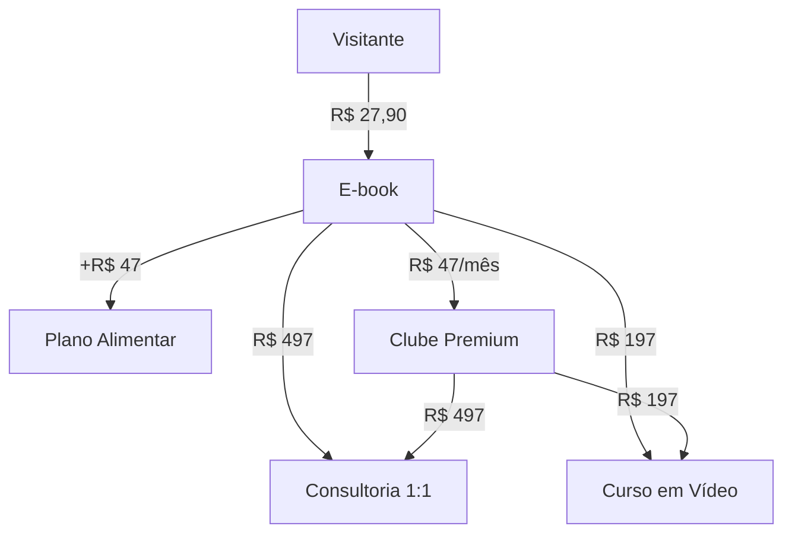

# 🌿 PRODUTO: CETOSE CONSCIENTE
## Plataforma Completa de Transformação Nutricional

**Versão:** 1.0  
**Data:** 2026-07-12  
**Status:** 🟢 Documento Fundamental

---

## 🎯 VISÃO GERAL DO PRODUTO

### O Que É

**Cetose Consciente** é uma plataforma digital completa que combina educação científica, tecnologia (IA), gamificação e comunidade para transformar vidas através da dieta cetogênica.

**Tagline:**
> "Transforme seu corpo em uma máquina de queimar gordura"

### O Que NÃO É

- ❌ Um simples e-book PDF
- ❌ Uma landing page estática
- ❌ Um curso gravado sem suporte
- ❌ Uma dieta da moda sem base científica
- ❌ Uma promessa de resultado rápido sem esforço

### O Que É

- ✅ Uma plataforma completa de transformação
- ✅ Um ecossistema digital integrado
- ✅ Uma jornada de educação e suporte contínuo
- ✅ Uma comunidade ativa de transformação
- ✅ Um produto baseado 100% em ciência

---

## 🎨 PROPOSTA DE VALOR

### Problema que Resolve

**O Ciclo da Frustração:**

```
Segunda-feira → Começa dieta com motivação
    ↓
Terça-feira → Sente fome durante o dia
    ↓
Quarta-feira → Fome aumenta à noite
    ↓
Quinta-feira → Compulsão por carboidratos
    ↓
Sexta-feira → Quebra a dieta
    ↓
Sábado → Culpa e frustração
    ↓
Domingo → Desiste da dieta
    ↓
Segunda-feira → Recomeça o ciclo
```

**Causa Raiz:**
> "Não é falta de força de vontade - é o corpo usando o combustível errado."

### Solução Oferecida

**O Ciclo da Transformação:**

```
Dia 1 → Aprende sobre cetose (e-book)
    ↓
Dia 2-7 → Entra em cetose (plano alimentar)
    ↓
Semana 2 → Fome diminui naturalmente
    ↓
Semana 3 → Energia aumenta
    ↓
Semana 4 → Primeiros resultados visíveis
    ↓
Mês 2 → Transformação consolidada
    ↓
Mês 3+ → Novo estilo de vida
```

### Diferencial Único

| Concorrentes | Cetose Consciente |
|--------------|-------------------|
| E-book PDF estático | E-book interativo (PWA) |
| Sem acompanhamento | IA assistente 24/7 |
| Plano genérico | Plano personalizado |
| Sem comunidade | Comunidade ativa |
| Sem gamificação | Sistema de recompensas |
| Conteúdo fixo | Atualizações constantes |
| Suporte limitado | Suporte contínuo |

---

## 🏗️ ESTRUTURA DO PRODUTO

### Camada 1: Aquisição

**Landing Page de Alta Conversão**

```yaml
Objetivo: Converter visitantes em compradores

Elementos:
  Hero Section:
    - Badge animado "Cetose Consciente"
    - Headline impactante (3 linhas)
    - Vídeo de vendas (PandaVideo)
    - CTA primário
  
  Faixa de Benefícios:
    - Marquee animado infinito
    - Palavras-chave: Cetose, Energia, Foco
  
  Seção Científica:
    - Citações Harvard + PubMed
    - Tabela comparativa
    - Gráfico de resultados
  
  Prova Social:
    - 3 transformações (antes/depois)
    - Depoimentos reais
  
  Oferta:
    - Preço: R$ 27,90
    - Comparação: ~~R$ 47,90~~
    - CTA: "QUERO ACESSAR AGORA"
  
  Garantia:
    - 7 dias risco zero
    - 100% do dinheiro de volta

Taxa de Conversão Esperada: 2-6%
```

---

### Camada 2: Produto Digital

**E-book Interativo (PWA)**

```yaml
Formato: Progressive Web App

Características:
  - Instalável no celular (iOS/Android)
  - Funciona offline
  - Push notifications
  - Rastreamento de progresso
  - Marcadores e anotações
  - Busca no conteúdo

Conteúdo (80-120 páginas):
  1. Introdução:
     - O ciclo da frustração
     - Por que as dietas falham
     - O que é cetose nutricional
  
  2. A Ciência da Cetose:
     - Como funciona o metabolismo
     - Glicose vs. Cetonas
     - Estudos científicos
     - Benefícios comprovados
  
  3. Protocolo Prático:
     - Como entrar em cetose
     - Alimentos permitidos/proibidos
     - Macros e proporções
     - Cardápios de exemplo
     - Receitas práticas
  
  4. Superando Desafios:
     - Keto flu (gripe cetogênica)
     - Adaptação social
     - Manutenção a longo prazo
     - Erros comuns
  
  5. Resultados e Manutenção:
     - Como medir cetose
     - Acompanhamento de progresso
     - Ajustes personalizados
     - Sustentabilidade
  
  6. Recursos Adicionais:
     - Lista de compras
     - Guia de restaurantes
     - FAQ completo
     - Referências científicas

Experiência:
  - Leitura otimizada para mobile
  - Modo escuro/claro
  - Ajuste de fonte
  - Progresso visual (% lido)
  - Tempo estimado de leitura
```

---

### Camada 3: Área de Membros

**Dashboard do Aluno**

```yaml
Acesso: Após compra do e-book

Seções Principais:

1. Biblioteca de Conteúdos:
   - E-book principal
   - Artigos científicos
   - Vídeo-aulas
   - Materiais complementares
   - Atualizações mensais

2. Receitas (500+):
   - Café da manhã (100)
   - Almoço (150)
   - Jantar (150)
   - Lanches (50)
   - Sobremesas (50)
   
   Filtros:
   - Por ingrediente
   - Por tempo de preparo
   - Por dificuldade
   - Por refeição
   - Por calorias
   
   Funcionalidades:
   - Favoritar receitas
   - Avaliar receitas
   - Comentar receitas
   - Compartilhar receitas
   - Gerar lista de compras

3. Plano Alimentar Personalizado:
   - Calculadora de macros:
     * Peso atual
     * Peso desejado
     * Altura
     * Idade
     * Sexo
     * Nível de atividade
     * Objetivo (perda/manutenção/ganho)
   
   - Cardápios:
     * Semanais
     * Mensais
     * Personalizados
     * Substituições automáticas
   
   - Lista de Compras:
     * Gerada automaticamente
     * Organizada por seção
     * Quantidades calculadas
     * Exportável (PDF/WhatsApp)
   
   - Tracking Diário:
     * Registro de refeições
     * Cálculo de macros
     * Gráficos de progresso
     * Histórico completo

4. IA Especialista em Cetose:
   - Chat 24/7:
     * Respostas instantâneas
     * Contexto personalizado
     * Referências científicas
     * Histórico de conversas
   
   - Análise de Refeições:
     * Upload de foto
     * Identificação de alimentos
     * Cálculo de macros
     * Sugestões de ajustes
   
   - Sugestões Personalizadas:
     * Baseadas no progresso
     * Adaptadas ao perfil
     * Considerando preferências
     * Atualizadas semanalmente

5. Gamificação:
   - Sistema de Pontos:
     * Ler e-book: 10 pontos/página
     * Fazer receita: 50 pontos
     * Completar desafio: 100 pontos
     * Streak diário: 20 pontos/dia
     * Ajudar comunidade: 30 pontos
   
   - Badges Desbloqueáveis:
     * 🥇 Iniciante (1 semana)
     * 🥈 Comprometido (1 mês)
     * 🥉 Transformado (3 meses)
     * 🏆 Mestre da Cetose (6 meses)
     * ⭐ Inspiração (1 ano)
   
   - Desafios Semanais:
     * Desafio de receitas
     * Desafio de hidratação
     * Desafio de exercícios
     * Desafio de sono
     * Desafio de mindfulness
   
   - Ranking:
     * Semanal
     * Mensal
     * Anual
     * Por categoria
     * Recompensas para top 10

6. Programa de Fidelidade:
   - Níveis:
     * Bronze (0-1000 pontos)
     * Prata (1001-5000 pontos)
     * Ouro (5001-10000 pontos)
     * Platina (10001+ pontos)
   
   - Benefícios:
     * Desconto em upsells
     * Acesso antecipado a conteúdo
     * Consultorias gratuitas
     * Materiais exclusivos
     * Prioridade no suporte
```

---

### Camada 4: Comunidade (Opcional)

**Clube Cetose Consciente**

```yaml
Tipo: Assinatura mensal (R$ 47/mês)
Objetivo: Engajamento e suporte contínuo

Funcionalidades:

1. Fórum da Comunidade:
   - Categorias:
     * Dúvidas gerais
     * Receitas
     * Transformações
     * Desabafos
     * Celebrações
   
   - Moderação:
     * Equipe dedicada
     * Regras claras
     * Ambiente positivo
     * Zero tolerância a bullying

2. Desafios Mensais:
   - Desafio de 30 dias
   - Grupos de apoio
   - Check-ins diários
   - Prêmios para vencedores
   - Certificado de conclusão

3. Ranking de Membros:
   - Por pontos
   - Por transformação
   - Por engajamento
   - Por ajuda à comunidade
   - Destaque mensal

4. Lives Semanais:
   - Terças 20h: Tira-dúvidas
   - Quintas 20h: Aula temática
   - Sábados 10h: Receita ao vivo
   - Domingos 19h: Motivação semanal

5. Eventos Especiais:
   - Webinars com especialistas
   - Workshops práticos
   - Encontros presenciais (futuro)
   - Retiros de imersão (futuro)

6. Mentorias em Grupo:
   - Grupos de 10-15 pessoas
   - Sessões quinzenais
   - Acompanhamento personalizado
   - Suporte entre membros

7. Suporte Prioritário:
   - Resposta em até 2h
   - WhatsApp exclusivo
   - Email prioritário
   - Chat ao vivo

Benefícios Exclusivos:
  - Acesso a todas as lives
  - Participação em desafios
  - Fórum exclusivo
  - Mentorias em grupo
  - Desconto em consultorias
  - Materiais exclusivos
  - Certificados de conclusão

Taxa de Conversão Esperada: 10-15%
Churn Esperado: 20-30%/mês
```

---

## 💰 MODELO DE MONETIZAÇÃO

### Funil de Valor



### Produtos e Preços

| Produto | Preço | Tipo | Conversão Esperada |
|---------|-------|------|-------------------|
| **E-book** | R$ 27,90 | Único | 2-6% (visitantes) |
| **Plano Alimentar** | +R$ 47 | Único | 20-30% (compradores) |
| **Clube Premium** | R$ 47/mês | Recorrente | 10-15% (compradores) |
| **Consultoria 1:1** | R$ 497 | Único | 5-10% (membros) |
| **Curso em Vídeo** | R$ 197 | Único | 15-20% (membros) |

### Lifetime Value (LTV)

```typescript
// Cenário Conservador
{
  ebook: 27.90,
  upsell1: 47 * 0.20 = 9.40,
  total: 37.30
}

// Cenário Realista
{
  ebook: 27.90,
  upsell1: 47 * 0.25 = 11.75,
  clube: 47 * 3 * 0.15 = 21.15, // 3 meses médio
  total: 60.80
}

// Cenário Otimista
{
  ebook: 27.90,
  upsell1: 47 * 0.30 = 14.10,
  clube: 47 * 6 * 0.20 = 56.40, // 6 meses médio
  curso: 197 * 0.15 = 29.55,
  consultoria: 497 * 0.05 = 24.85,
  total: 152.80
}
```

---

## 👥 PERSONAS

### Persona Primária: "Ana, a Recomeçadora" (70%)

```yaml
Demografia:
  Nome: Ana Paula Silva
  Idade: 38 anos
  Gênero: Feminino
  Estado Civil: Casada, 2 filhos
  Localização: São Paulo, SP
  Profissão: Gerente de RH
  Renda: R$ 8.000-12.000/mês
  Escolaridade: Superior completo

Psicográfico:
  Personalidade:
    - Organizada e planejadora
    - Perfeccionista
    - Autoexigente
    - Valoriza ciência
    - Busca soluções práticas
  
  Valores:
    - Saúde da família
    - Autoestima
    - Produtividade
    - Conhecimento
    - Sustentabilidade

Comportamento Online:
  - Instagram: 30-60 min/dia
  - Facebook: Grupos de mães
  - YouTube: Vídeos educativos à noite
  - Compra online frequentemente
  - Pesquisa antes de comprar

Dores:
  Principal: "Fome incontrolável à noite que sabota a dieta"
  
  Específicas:
    - Efeito sanfona (5+ vezes)
    - Falta de energia
    - Culpa e vergonha
    - Confusão de informação
    - Medo de falhar de novo

Desejos:
  Imediatos:
    - Perder 10-15kg
    - Eliminar fome noturna
    - Ter mais energia
    - Caber nas roupas antigas
  
  Profundos:
    - Autoestima restaurada
    - Confiança no próprio corpo
    - Liberdade alimentar
    - Ser exemplo para os filhos
    - Envelhecer com saúde

Objeções:
  Racionais:
    - "Mais uma dieta que não vai funcionar"
    - "Já tentei low carb e não deu certo"
    - "Não tenho tempo para cozinhar"
    - "E se eu não conseguir manter?"
  
  Emocionais:
    - Medo de falhar de novo
    - Medo de passar fome
    - Medo de não ter disciplina
    - Medo de efeito sanfona

Jornada:
  1. Conscientização: "Por que eu sempre falho?"
  2. Consideração: "Será que cetose funciona?"
  3. Decisão: "Vou tentar, mas com garantia"
  4. Pós-Compra: "Vou seguir direitinho"
  5. Advocacia: "Preciso contar para minhas amigas!"
```

### Persona Secundária: "Carlos, o Executivo" (20%)

```yaml
Demografia:
  Nome: Carlos Eduardo Santos
  Idade: 42 anos
  Gênero: Masculino
  Estado Civil: Casado, 1 filho
  Localização: Rio de Janeiro, RJ
  Profissão: Gerente Comercial
  Renda: R$ 12.000-18.000/mês

Dores:
  - Barriga saliente
  - Falta de energia e foco
  - Colesterol alto
  - Pressão arterial elevada

Desejos:
  - Perder barriga
  - Mais energia e clareza mental
  - Melhorar saúde (exames)
  - Performance no trabalho
  - Ser ativo com o filho
```

### Persona Terciária: "Juliana, a Profissional de Saúde" (10%)

```yaml
Demografia:
  Nome: Juliana Oliveira
  Idade: 32 anos
  Gênero: Feminino
  Profissão: Nutricionista
  Localização: Belo Horizonte, MG
  Renda: R$ 6.000-10.000/mês

Motivação:
  - Atualização profissional
  - Protocolo para recomendar
  - Validação científica
  - Diferencial competitivo

Desejos:
  - Conhecimento aprofundado
  - Referências científicas
  - Protocolo prático
  - Credibilidade profissional
```

---

## 📊 MÉTRICAS DE SUCESSO

### KPIs do Produto

```yaml
Aquisição:
  - Visitantes/mês: 500 → 10.000
  - Taxa de Conversão: 2% → 6%
  - CPL: R$ 10 → R$ 5
  - CAC: R$ 50 → R$ 30

Ativação:
  - % que lê e-book: > 60%
  - % que usa calculadora: > 40%
  - % que faz receita: > 30%
  - % que conversa com IA: > 50%

Engajamento:
  - DAU (Daily Active Users): 1.000+
  - Tempo médio no app: 15+ min
  - Sessões/semana: 3+
  - Receitas feitas/mês: 10+

Retenção:
  - Taxa de retenção (7 dias): > 70%
  - Taxa de retenção (30 dias): > 60%
  - Taxa de retenção (90 dias): > 40%
  - Churn mensal (clube): < 30%

Receita:
  - MRR: R$ 0 → R$ 50.000
  - LTV: R$ 27,90 → R$ 300
  - LTV/CAC: 0.5 → 10
  - Taxa de upsell: > 20%

Satisfação:
  - NPS: > 70
  - Rating App Store: > 4.5
  - Taxa de reembolso: < 5%
  - Depoimentos positivos: 100+/mês
```

---

## 🔬 BASE CIENTÍFICA

### Estudos de Referência

```yaml
Harvard Health Publishing:
  - "Should you try the keto diet?" (2024)
  - Validação: Redução de peso comprovada
  - Link: health.harvard.edu

PubMed:
  - Zhou C. et al. "Ketogenic diet for obesity" (2022)
  - Validação: Diminuição circunferência abdominal
  - PMID: 35583955

Journal of Nutrition:
  - Paoli A. "Ketogenic Diet for Obesity" (2014)
  - Validação: Melhora controle glicêmico
  - DOI: 10.3390/nu6020548

Benefícios Comprovados:
  - ✅ Redução de peso corporal
  - ✅ Diminuição da circunferência abdominal
  - ✅ Melhora no controle glicêmico
  - ✅ Redução de triglicerídeos
  - ✅ Aumento do HDL (colesterol bom)
  - ✅ Melhora na clareza mental
  - ✅ Aumento de energia estável
```

---

## 📚 DOCUMENTAÇÃO RELACIONADA

Este documento faz parte de um conjunto de 4 documentos fundamentais:

1. **[`VISION.md`](VISION.md)**
   - Visão, missão e objetivos do projeto

2. **[`ARCHITECTURE.md`](ARCHITECTURE.md)**
   - Arquitetura técnica e módulos do sistema

3. **[`ROADMAP.md`](ROADMAP.md)**
   - Plano de desenvolvimento por fases

4. **[`PRODUCT.md`](PRODUCT.md)** ← Você está aqui
   - Descrição detalhada do produto Cetose Consciente

---

**Versão:** 1.0  
**Última Atualização:** 2026-07-12  
**Próxima Revisão:** 2026-10-12 (trimestral)

---

> "O produto não é o e-book. O produto é a transformação."  
> — Avalon Bay
