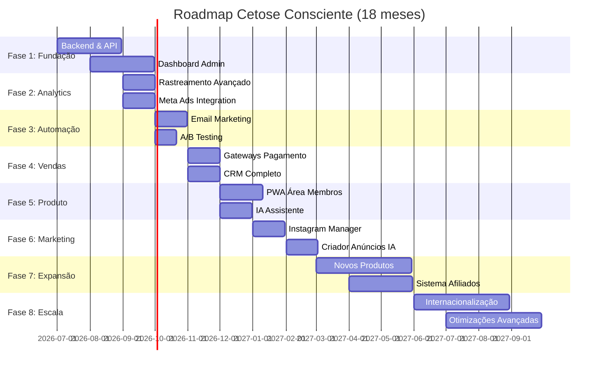

# 🗺️ ROADMAP DE DESENVOLVIMENTO
## Cetose Consciente - Plataforma de Transformação Nutricional

**Versão:** 1.0  
**Data:** 2026-07-12  
**Status:** 🟢 Documento Fundamental  
**Horizonte:** 18 meses (Jul 2026 - Dez 2027)

---

## 📊 VISÃO GERAL

### Fases de Desenvolvimento

### Resumo Executivo

| Fase | Período | Módulos | Objetivo Principal |
|------|---------|---------|-------------------|
| **1. Fundação** | Meses 1-2 | 1-2 | Criar infraestrutura base |
| **2. Analytics** | Mês 3 | 3-4 | Rastreamento e otimização |
| **3. Automação** | Mês 4 | 5-6 | Escalar sem trabalho manual |
| **4. Vendas** | Mês 5 | 7-8 | Múltiplos gateways e CRM |
| **5. Produto** | Mês 6 | 9-10 | PWA e experiência premium |
| **6. Marketing** | Mês 7-8 | - | Automação de conteúdo |
| **7. Expansão** | Mês 9-12 | - | Novos produtos e canais |
| **8. Escala** | Mês 13-18 | - | Internacionalização |

---

## 🚀 FASE 1: FUNDAÇÃO (Meses 1-2)

### Objetivo
Criar a infraestrutura backend e dashboard administrativo que servirão como base para todos os módulos seguintes.

### Módulo 1: Backend & API (30 dias)

**Semana 1-2: Setup e Autenticação**
- [ ] Configurar projeto Node.js + TypeScript
- [ ] Instalar dependências (Express, Prisma, Zod, JWT)
- [ ] Configurar PostgreSQL e Redis
- [ ] Criar schema Prisma inicial
- [ ] Implementar autenticação JWT
- [ ] Criar middleware de segurança (rate limiting, CORS, Helmet)

**Semana 3-4: CRUD e Deploy**
- [ ] Criar endpoints de CRUD para Leads
- [ ] Criar endpoints de CRUD para Pages
- [ ] Implementar endpoints de Analytics
- [ ] Criar documentação Swagger
- [ ] Escrever testes unitários (Jest)
- [ ] Configurar CI/CD (GitHub Actions)
- [ ] Deploy em ambiente de staging (Railway/Render)

**Entregáveis:**
- ✅ API REST funcional com autenticação
- ✅ Banco de dados PostgreSQL configurado
- ✅ Documentação Swagger acessível
- ✅ Cobertura de testes > 80%
- ✅ Deploy automatizado funcionando

**KPIs:**
- Uptime > 99.9%
- Response Time < 200ms
- Cobertura de Testes > 80%

---

### Módulo 2: Dashboard Administrativo (30 dias)

**Semana 1-2: Setup e Layout**
- [ ] Configurar projeto Next.js 14 (App Router)
- [ ] Instalar shadcn/ui e configurar Tailwind
- [ ] Criar layout do dashboard
- [ ] Implementar autenticação (NextAuth.js)
- [ ] Criar página de overview com métricas básicas

**Semana 3-4: Páginas Principais**
- [ ] Implementar gestão de leads (lista, detalhes, filtros)
- [ ] Implementar gestão de páginas (CRUD)
- [ ] Criar dashboard de analytics (gráficos)
- [ ] Integrar com API backend
- [ ] Deploy em Vercel

**Entregáveis:**
- ✅ Dashboard Next.js funcionando
- ✅ Gestão de leads implementada
- ✅ Gráficos de métricas
- ✅ Deploy em Vercel

**KPIs:**
- Lighthouse Score > 90
- Todas operações CRUD funcionando
- Tempo de carregamento < 2s

---

## 📊 FASE 2: ANALYTICS (Mês 3)

### Objetivo
Implementar rastreamento avançado e integração com Meta Ads para otimização de campanhas.

### Módulo 3: Rastreamento Avançado (20 dias)

**Semana 1-2: Setup de Analytics**
- [ ] Configurar Google Analytics 4
- [ ] Implementar Google Tag Manager
- [ ] Instalar Facebook Pixel
- [ ] Criar eventos customizados
- [ ] Implementar API de analytics no backend

**Semana 3: Dashboard de Métricas**
- [ ] Criar dashboard de métricas no admin
- [ ] Implementar funil de conversão
- [ ] Criar relatórios de origem de tráfego
- [ ] Implementar análise de dispositivos

**Entregáveis:**
- ✅ GA4 + GTM + Facebook Pixel configurados
- ✅ Eventos customizados rastreados
- ✅ Dashboard de métricas funcionando

**KPIs:**
- Taxa de Rastreamento: 100%
- Latência < 100ms
- Taxa de Erro < 1%

---

### Módulo 4: Integração com Meta Ads (25 dias)

**Semana 1-2: Meta Marketing API**
- [ ] Configurar Meta Business Manager
- [ ] Integrar Marketing API
- [ ] Criar interface de campanhas
- [ ] Implementar criação de ad sets
- [ ] Implementar criação de anúncios

**Semana 3-4: Conversions API e Relatórios**
- [ ] Implementar Conversions API (server-side tracking)
- [ ] Configurar webhook de eventos
- [ ] Criar relatórios de performance
- [ ] Implementar cálculo de ROAS
- [ ] Criar biblioteca de criativos

**Entregáveis:**
- ✅ Campanhas criadas via API
- ✅ Conversions API implementada
- ✅ Relatórios de performance

**KPIs:**
- ROAS > 3.0
- Campanhas criadas via API
- Conversões rastreadas server-side

---

## 🤖 FASE 3: AUTOMAÇÃO (Mês 4)

### Objetivo
Implementar automações de email marketing e sistema de A/B testing para escalar sem trabalho manual.

### Módulo 5: Email Marketing (20 dias)

**Semana 1-2: Setup e Templates**
- [ ] Configurar SendGrid
- [ ] Criar templates com React Email
- [ ] Implementar Bull Queue para envio assíncrono
- [ ] Criar sistema de segmentação

**Semana 3: Automações**
- [ ] Implementar sequência de boas-vindas
- [ ] Implementar carrinho abandonado
- [ ] Implementar pós-compra
- [ ] Criar interface de gestão de emails

**Entregáveis:**
- ✅ SendGrid configurado
- ✅ Templates React Email criados
- ✅ 3 automações funcionando

**KPIs:**
- Taxa de Entrega > 95%
- Taxa de Abertura > 25%
- Taxa de Clique > 5%

---

### Módulo 6: A/B Testing (15 dias)

**Semana 1-2: Sistema de Experimentos**
- [ ] Criar sistema de experimentos
- [ ] Implementar algoritmo de atribuição
- [ ] Implementar cálculo estatístico
- [ ] Criar interface de testes
- [ ] Rodar 3 testes iniciais

**Entregáveis:**
- ✅ Sistema de A/B testing funcional
- ✅ Análise estatística implementada
- ✅ 3 testes rodando

**KPIs:**
- Sistema funcional
- Significância estatística (p < 0.05)
- Pelo menos 1 teste com winner

---

## 💰 FASE 4: VENDAS (Mês 5)

### Objetivo
Implementar múltiplos gateways de pagamento e CRM completo.

### Módulo 7: Gateways de Pagamento (20 dias)

**Semana 1-2: Integrações**
- [ ] Integrar Stripe
- [ ] Integrar Mercado Pago
- [ ] Manter integração Kiwify
- [ ] Implementar webhooks

**Semana 3: Gestão Financeira**
- [ ] Criar sistema de reconciliação
- [ ] Implementar relatórios de transações
- [ ] Criar gestão de assinaturas
- [ ] Implementar sistema de reembolsos

**Entregáveis:**
- ✅ 3 gateways funcionais
- ✅ Webhooks processando
- ✅ Relatórios financeiros

**KPIs:**
- Taxa de Sucesso > 95%
- Webhooks processando corretamente
- Reconciliação automática

---

### Módulo 8: CRM Completo (25 dias)

**Semana 1-2: Pipeline e Lead Scoring**
- [ ] Criar schema do CRM
- [ ] Implementar pipeline de vendas (5 estágios)
- [ ] Implementar lead scoring automático
- [ ] Criar timeline de atividades

**Semana 3-4: Integrações e Interface**
- [ ] Integrar WhatsApp Business API
- [ ] Criar sistema de segmentação
- [ ] Implementar interface de CRM
- [ ] Criar relatórios de vendas

**Entregáveis:**
- ✅ CRM funcional
- ✅ Lead scoring calculado
- ✅ WhatsApp integrado

**KPIs:**
- Tempo de Resposta < 2h
- Lead scoring calculado
- Pipeline funcional

---

## 📱 FASE 5: PRODUTO DIGITAL (Mês 6)

### Objetivo
Desenvolver PWA (área de membros) e IA assistente especializada.

### Módulo 9: PWA - Área de Membros (40 dias)

**Semana 1-2: Setup e E-book**
- [ ] Configurar PWA (Service Workers)
- [ ] Implementar e-book interativo
- [ ] Criar sistema de progresso
- [ ] Implementar marcadores e anotações
- [ ] Configurar offline-first

**Semana 3-4: Receitas e Plano Alimentar**
- [ ] Criar biblioteca de receitas (500+)
- [ ] Implementar filtros e busca
- [ ] Criar calculadora de macros
- [ ] Implementar plano alimentar personalizado
- [ ] Criar lista de compras automática

**Semana 5-6: Gamificação e Notificações**
- [ ] Implementar sistema de pontos
- [ ] Criar badges desbloqueáveis
- [ ] Implementar desafios semanais
- [ ] Criar ranking de membros
- [ ] Configurar push notifications

**Entregáveis:**
- ✅ PWA instalável
- ✅ E-book interativo
- ✅ Receitas e plano alimentar
- ✅ Gamificação completa

**KPIs:**
- PWA instalável
- Funciona offline
- Push notifications entregues
- Lighthouse Score > 90

---

### Módulo 10: IA Assistente (30 dias)

**Semana 1-2: Integração OpenAI**
- [ ] Integrar OpenAI API (GPT-4)
- [ ] Criar base de conhecimento treinada
- [ ] Implementar chat interface
- [ ] Criar sistema de contexto

**Semana 3-4: Funcionalidades Avançadas**
- [ ] Implementar análise de refeições por foto
- [ ] Criar sugestões personalizadas
- [ ] Implementar respostas com referências científicas
- [ ] Criar fallback para respostas pré-definidas

**Entregáveis:**
- ✅ IA assistente funcional
- ✅ Chat 24/7 disponível
- ✅ Análise de refeições

**KPIs:**
- Tempo de resposta < 3s
- Taxa de satisfação > 80%
- Fallback funcionando

---

## 📢 FASE 6: MARKETING AVANÇADO (Mês 7-8)

### Objetivo
Automatizar criação de conteúdo e postagens.

### Instagram Manager (30 dias)

**Semana 1-2: Integração**
- [ ] Integrar Instagram Graph API
- [ ] Criar sistema de postagem automática
- [ ] Implementar agendamento
- [ ] Criar biblioteca de conteúdo

**Semana 3-4: Analytics e Otimização**
- [ ] Implementar analytics integrado
- [ ] Criar relatórios de performance
- [ ] Implementar sugestões de horários
- [ ] Criar templates de posts

**Entregáveis:**
- ✅ Postagem automática funcionando
- ✅ Agendamento implementado
- ✅ Analytics integrado

---

### Criador de Anúncios com IA (30 dias)

**Semana 1-2: Geração de Conteúdo**
- [ ] Implementar geração de headlines com IA
- [ ] Criar geração de copies
- [ ] Implementar sugestões de criativos
- [ ] Criar variações automáticas

**Semana 3-4: Otimização e Testes**
- [ ] Implementar otimização automática
- [ ] Criar testes A/B automáticos
- [ ] Implementar análise de performance
- [ ] Criar recomendações de melhoria

**Entregáveis:**
- ✅ Geração de conteúdo com IA
- ✅ Testes A/B automáticos
- ✅ Otimização funcionando

---

## 🌟 FASE 7: EXPANSÃO (Mês 9-12)

### Objetivo
Lançar novos produtos e sistema de afiliados.

### Novos Produtos (90 dias)

**Mês 9-10: Curso em Vídeo**
- [ ] Gravar 20+ vídeo-aulas
- [ ] Criar plataforma de cursos
- [ ] Implementar certificação
- [ ] Lançar curso (R$ 197)

**Mês 11: Comunidade Premium**
- [ ] Criar fórum da comunidade
- [ ] Implementar lives semanais
- [ ] Criar sistema de eventos
- [ ] Lançar assinatura (R$ 47/mês)

**Mês 12: Consultoria 1:1**
- [ ] Criar sistema de agendamento
- [ ] Integrar Zoom/Google Meet
- [ ] Implementar pagamento
- [ ] Lançar consultoria (R$ 497)

**Entregáveis:**
- ✅ 3 novos produtos lançados
- ✅ LTV > R$ 300
- ✅ Receita recorrente > 50%

---

### Sistema de Afiliados (60 dias)

**Mês 10-11: Desenvolvimento**
- [ ] Criar dashboard de afiliados
- [ ] Implementar links rastreáveis
- [ ] Criar sistema de comissões
- [ ] Implementar pagamentos automáticos

**Mês 11-12: Materiais e Lançamento**
- [ ] Criar materiais de divulgação
- [ ] Implementar relatórios de performance
- [ ] Criar programa de treinamento
- [ ] Lançar programa de afiliados

**Entregáveis:**
- ✅ Sistema de afiliados funcional
- ✅ 100+ afiliados ativos
- ✅ 20% da receita via afiliados

---

## 🌍 FASE 8: ESCALA (Mês 13-18)

### Objetivo
Internacionalização e otimizações avançadas.

### Internacionalização (90 dias)

**Mês 13-14: Versão em Inglês**
- [ ] Traduzir todo conteúdo
- [ ] Adaptar landing page
- [ ] Configurar pagamentos internacionais
- [ ] Lançar versão em inglês

**Mês 15-16: Versão em Espanhol**
- [ ] Traduzir todo conteúdo
- [ ] Adaptar para mercado latino
- [ ] Configurar pagamentos locais
- [ ] Lançar versão em espanhol

**Mês 17-18: Marketing Internacional**
- [ ] Criar campanhas para EUA
- [ ] Criar campanhas para América Latina
- [ ] Contratar suporte multilíngue
- [ ] Expandir para 5+ países

**Entregáveis:**
- ✅ 3 idiomas suportados
- ✅ 20% receita internacional
- ✅ Presença em 5+ países

---

### Otimizações Avançadas (90 dias)

**Mês 13-15: Performance**
- [ ] Implementar CDN global
- [ ] Otimizar queries do banco
- [ ] Implementar caching avançado
- [ ] Lazy loading de componentes
- [ ] Code splitting

**Mês 16-18: Conversão e Automação**
- [ ] Rodar 10+ testes A/B
- [ ] Otimizar copy e design
- [ ] Implementar chat ao vivo
- [ ] Melhorar prova social
- [ ] Automação avançada com IA

**Entregáveis:**
- ✅ Lighthouse > 95
- ✅ Conversão: 5% → 7%
- ✅ 80% tarefas automatizadas

---

## 📊 MÉTRICAS DE PROGRESSO

### Mês a Mês

| Mês | Módulos Completos | Leads/mês | Conversão | Receita/mês | Status |
|-----|-------------------|-----------|-----------|-------------|--------|
| 0 | 0/10 | 500 | 2% | R$ 2.790 | ✅ Atual |
| 1 | 1/10 | 600 | 2% | R$ 3.348 | 📅 Planejado |
| 2 | 2/10 | 800 | 2.5% | R$ 5.580 | 📅 Planejado |
| 3 | 4/10 | 1.200 | 3% | R$ 10.044 | 📅 Planejado |
| 4 | 6/10 | 2.000 | 3.5% | R$ 19.530 | 📅 Planejado |
| 5 | 8/10 | 3.000 | 4% | R$ 33.480 | 📅 Planejado |
| 6 | 10/10 | 5.000 | 5% | R$ 69.750 | 🎯 Meta |
| 12 | 10/10 | 10.000 | 6% | R$ 167.400 | 🎯 Meta |
| 18 | 10/10 | 20.000 | 7% | R$ 391.300 | 🚀 Visão |

---

## 🎯 MILESTONES PRINCIPAIS

### Q3 2026 (Meses 1-3)
- ✅ **M1:** Backend API funcional
- ✅ **M2:** Dashboard admin lançado
- ✅ **M3:** Rastreamento completo implementado

### Q4 2026 (Meses 4-6)
- ✅ **M4:** Automações de email ativas
- ✅ **M5:** CRM operacional
- ✅ **M6:** PWA e IA lançados (Plataforma completa)

### Q1 2027 (Meses 7-9)
- ✅ **M7:** Marketing automatizado
- ✅ **M8:** Novos produtos lançados
- ✅ **M9:** Break-even atingido

### Q2 2027 (Meses 10-12)
- ✅ **M10:** Sistema de afiliados ativo
- ✅ **M11:** LTV > R$ 300
- ✅ **M12:** Receita > R$ 150k/mês

### Q3-Q4 2027 (Meses 13-18)
- ✅ **M13:** Versão em inglês lançada
- ✅ **M14:** Versão em espanhol lançada
- ✅ **M15:** Presença internacional estabelecida

---

## 🔄 PROCESSO DE REVISÃO

### Revisões Semanais
- **Segunda-feira:** Planejamento da semana
- **Sexta-feira:** Retrospectiva e ajustes

### Revisões Mensais
- Análise de KPIs
- Ajuste de prioridades
- Atualização do roadmap
- Revisão de budget

### Revisões Trimestrais
- Revisão estratégica
- Planejamento do próximo trimestre
- Ajuste de metas
- Análise de ROI

---

## 📚 DOCUMENTAÇÃO RELACIONADA

Este documento faz parte de um conjunto de 4 documentos fundamentais:

1. **[`VISION.md`](VISION.md)**
   - Visão, missão e objetivos do projeto

2. **[`ARCHITECTURE.md`](ARCHITECTURE.md)**
   - Arquitetura técnica e módulos do sistema

3. **[`ROADMAP.md`](ROADMAP.md)** ← Você está aqui
   - Plano de desenvolvimento por fases

4. **[`PRODUCT.md`](PRODUCT.md)**
   - Descrição detalhada do produto Cetose Consciente

---

**Versão:** 1.0  
**Última Atualização:** 2026-07-12  
**Próxima Revisão:** 2026-08-12 (mensal)

---

> "O sucesso é a soma de pequenos esforços repetidos dia após dia."  
> — Robert Collier
