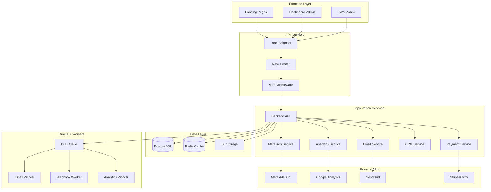

# 🏗️ Arquitetura Geral - Cetose Consciente

> Visão técnica completa da plataforma de marketing digital.

---

## 📊 Visão Geral

### Estado Atual
**Landing Page Estática** com integrações básicas

### Estado Futuro (6-12 meses)
**Plataforma Completa de Marketing Digital** com 10 módulos integrados

---

## 🎯 Arquitetura Atual (v1.0)

### Componentes
```
┌─────────────────────────────────────┐
│       Landing Page (index.html)      │
│     HTML5 + CSS + Tailwind CSS      │
└──────────────┬──────────────────────┘
               │
       ┌───────┴───────┐
       │               │
   ┌───▼────┐    ┌────▼─────┐
   │PandaVideo│    │ Kiwify   │
   │  Player  │    │ Checkout │
   └──────────┘    └──────────┘
```

### Stack Tecnológica
- **Frontend:** HTML5 + CSS puro + Tailwind CSS v3.4.19
- **Tipografia:** Google Fonts (Inter, Manrope, Geist)
- **Ícones:** Lucide Icons + Iconify
- **Vídeo:** PandaVideo (embed)
- **Pagamento:** Kiwify
- **Background:** UnicornStudio (3D animado)
- **Hospedagem:** GitHub Pages (inferido)

### Integrações Externas
1. **PandaVideo** - Hospedagem de vídeo
2. **Kiwify** - Gateway de pagamento
3. **Google Fonts** - Tipografia
4. **Iconify CDN** - Ícones
5. **UnicornStudio** - Background 3D

---

## 🚀 Arquitetura Futura (v2.0)

### Visão Macro



---

## 📦 Módulos da Plataforma

### Módulo 1: Backend & API
**Tecnologias:**
- Node.js 20+ + TypeScript
- Express.js / Fastify
- Prisma ORM
- PostgreSQL 15+
- Redis 7+

**Responsabilidades:**
- Autenticação JWT
- CRUD de leads
- CRUD de páginas
- Gestão de usuários
- API REST documentada (Swagger)

### Módulo 2: Dashboard Admin
**Tecnologias:**
- Next.js 14+ (App Router)
- React 18+ + TypeScript
- shadcn/ui + Tailwind CSS
- TanStack Query
- Zustand

**Funcionalidades:**
- Gestão de leads
- Gestão de páginas
- Analytics e métricas
- Configurações

### Módulo 3: Rastreamento Avançado
**Tecnologias:**
- Google Analytics 4
- Google Tag Manager
- Facebook Pixel
- Custom Events API

**Eventos Rastreados:**
- Page views
- Scroll depth
- Video play/complete
- CTA clicks
- Form submits
- Purchases

### Módulo 4: Meta Ads Integration
**Tecnologias:**
- Meta Marketing API
- Meta Conversions API
- Facebook Business SDK

**Funcionalidades:**
- Criar/gerenciar campanhas
- Rastreamento server-side
- Relatórios de performance
- Otimização automática

### Módulo 5: Email Marketing
**Tecnologias:**
- SendGrid / Mailgun
- React Email (templates)
- Bull Queue + Redis
- Nodemailer (fallback)

**Automações:**
- Boas-vindas
- Carrinho abandonado
- Pós-compra
- Nurturing

### Módulo 6: A/B Testing
**Tecnologias:**
- Custom implementation
- Statistical analysis
- React hooks

**Testes:**
- Headlines
- CTAs
- Preços
- Layouts

### Módulo 7: Gateways de Pagamento
**Tecnologias:**
- Stripe SDK
- Kiwify API
- Mercado Pago SDK
- Webhook handlers

**Funcionalidades:**
- Checkout unificado
- Webhooks
- Reconciliação
- Reembolsos

### Módulo 8: CRM
**Tecnologias:**
- Custom CRM
- WhatsApp Business API
- Twilio (SMS)

**Funcionalidades:**
- Pipeline de vendas
- Lead scoring
- Timeline de atividades
- Segmentação

### Módulo 9: PWA & Mobile
**Tecnologias:**
- Next.js PWA
- Service Workers
- Workbox
- Web Push API

**Funcionalidades:**
- Instalação no dispositivo
- Offline first
- Push notifications
- Experiência mobile

### Módulo 10: Webhooks
**Tecnologias:**
- Bull Queue
- HMAC signatures
- Retry logic

**Integrações:**
- Zapier
- Make (Integromat)
- Slack
- Google Sheets

---

## 🗄️ Modelo de Dados

### Schema Principal (Prisma)

```prisma
// Usuários e Autenticação
model User {
  id            String   @id @default(cuid())
  email         String   @unique
  passwordHash  String
  name          String?
  role          Role     @default(USER)
  createdAt     DateTime @default(now())
  updatedAt     DateTime @updatedAt
  
  pages         Page[]
  campaigns     Campaign[]
}

// Leads
model Lead {
  id            String   @id @default(cuid())
  email         String
  name          String?
  phone         String?
  source        String?
  medium        String?
  campaign      String?
  pageSlug      String
  status        LeadStatus @default(NEW)
  score         Int      @default(0)
  createdAt     DateTime @default(now())
  updatedAt     DateTime @updatedAt
  
  page          Page     @relation(fields: [pageSlug], references: [slug])
  events        Event[]
  activities    Activity[]
  deals         Deal[]
}

// Landing Pages
model Page {
  id            String   @id @default(cuid())
  slug          String   @unique
  title         String
  description   String?
  content       Json
  isActive      Boolean  @default(true)
  userId        String
  createdAt     DateTime @default(now())
  updatedAt     DateTime @updatedAt
  
  user          User     @relation(fields: [userId], references: [id])
  leads         Lead[]
  events        Event[]
}

// Eventos de Analytics
model Event {
  id            String   @id @default(cuid())
  type          EventType
  pageSlug      String?
  leadId        String?
  metadata      Json?
  createdAt     DateTime @default(now())
  
  page          Page?    @relation(fields: [pageSlug], references: [slug])
  lead          Lead?    @relation(fields: [leadId], references: [id])
}

// Pagamentos
model Payment {
  id            String   @id @default(cuid())
  transactionId String   @unique
  gateway       Gateway
  amount        Float
  currency      String   @default("BRL")
  status        PaymentStatus
  leadId        String
  createdAt     DateTime @default(now())
  paidAt        DateTime?
  
  lead          Lead     @relation(fields: [leadId], references: [id])
}

// Experimentos A/B
model Experiment {
  id            String   @id @default(cuid())
  name          String
  description   String?
  isActive      Boolean  @default(false)
  createdAt     DateTime @default(now())
  
  variants      Variant[]
  assignments   ExperimentAssignment[]
}

model Variant {
  id            String   @id @default(cuid())
  experimentId  String
  name          String
  isControl     Boolean  @default(false)
  weight        Int      @default(50)
  changes       Json
  
  experiment    Experiment @relation(fields: [experimentId], references: [id])
}

// Enums
enum Role {
  USER
  ADMIN
}

enum LeadStatus {
  NEW
  CONTACTED
  QUALIFIED
  CONVERTED
  LOST
}

enum EventType {
  PAGE_VIEW
  VIDEO_PLAY
  VIDEO_COMPLETE
  CTA_CLICK
  FORM_SUBMIT
  PURCHASE
}

enum Gateway {
  KIWIFY
  STRIPE
  MERCADOPAGO
}

enum PaymentStatus {
  PENDING
  COMPLETED
  FAILED
  REFUNDED
}
```

---

## 🔐 Segurança

### Camadas de Segurança

#### 1. Autenticação
- JWT com refresh tokens
- Bcrypt para passwords (12 rounds)
- 2FA para admins
- Rate limiting (100 req/min)

#### 2. Autorização
- RBAC (Role-Based Access Control)
- Middleware de permissões
- Validação de ownership

#### 3. Dados
- Criptografia TLS 1.3 (em trânsito)
- Criptografia AES-256 (em repouso)
- Sanitização de inputs (Zod)
- Prepared statements (SQL injection)

#### 4. Infraestrutura
- WAF (Web Application Firewall)
- DDoS protection (Cloudflare)
- Firewall de rede
- Backups diários

#### 5. Compliance
- LGPD compliant
- Política de privacidade
- Termos de uso
- Consentimento explícito

---

## 📊 Escalabilidade

### Estratégias

#### Horizontal Scaling
- Load balancer (Nginx/Cloudflare)
- Múltiplas instâncias do backend
- Auto-scaling baseado em CPU/memória

#### Caching
- Redis para sessões
- Redis para queries frequentes
- CDN para assets estáticos
- Browser caching (Service Worker)

#### Database
- Connection pooling
- Read replicas
- Índices otimizados
- Query optimization

#### Queue
- Bull Queue para tarefas assíncronas
- Workers dedicados
- Retry com backoff exponencial

---

## 🔄 CI/CD

### Pipeline

```yaml
# .github/workflows/deploy.yml

name: Deploy

on:
  push:
    branches: [main]

jobs:
  test:
    runs-on: ubuntu-latest
    steps:
      - uses: actions/checkout@v3
      - uses: actions/setup-node@v3
      - run: npm ci
      - run: npm test
      - run: npm run lint

  deploy-frontend:
    needs: test
    runs-on: ubuntu-latest
    steps:
      - uses: actions/checkout@v3
      - uses: vercel/action@v1
        with:
          vercel-token: ${{ secrets.VERCEL_TOKEN }}

  deploy-backend:
    needs: test
    runs-on: ubuntu-latest
    steps:
      - uses: actions/checkout@v3
      - uses: railway/deploy@v1
        with:
          railway-token: ${{ secrets.RAILWAY_TOKEN }}
```

---

## 📈 Monitoramento

### Ferramentas

#### Application Monitoring
- **Sentry:** Erros e exceções
- **Datadog:** Métricas de performance
- **LogRocket:** Session replay

#### Infrastructure Monitoring
- **Uptime Robot:** Disponibilidade
- **CloudWatch:** Logs e métricas AWS
- **Grafana:** Dashboards customizados

#### Business Metrics
- **Google Analytics:** Tráfego e conversões
- **Mixpanel:** Eventos de produto
- **Custom Dashboard:** KPIs de negócio

---

## 🔗 Recursos Relacionados

- **Planos Detalhados:** [`/plans`](../plans/)
- **Roadmap:** [`roadmap.md`](./roadmap.md)
- **Documentação Técnica:** [`/info.md`](../info.md)

---

**Última Atualização:** 2026-07-11  
**Versão:** 1.0  
**Responsável:** Equipe de Arquitetura
