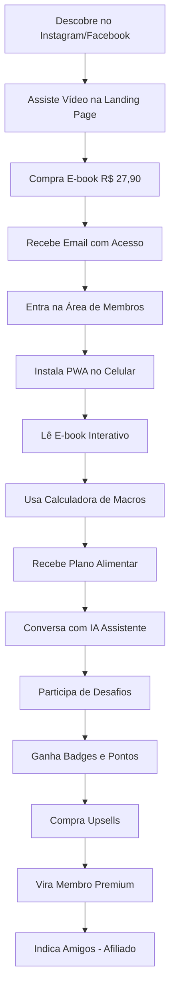
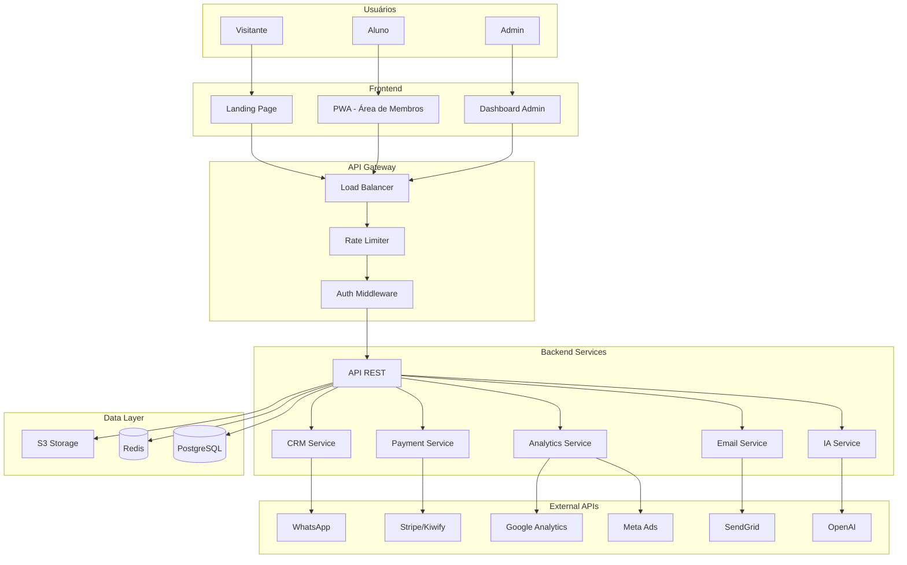

# 🏗️ ANÁLISE COMPLETA: CLUBE CETOSE CONSCIENTE
## Da Landing Page à Plataforma Digital Completa

**Data:** 2026-07-12  
**Versão:** 2.0  
**Status:** ✅ Análise Estratégica Completa

---

## 🎯 VISÃO CORRIGIDA DO PROJETO

### ⚠️ CORREÇÃO CRÍTICA DE ENTENDIMENTO

**ANTES (Visão Incorreta):**
> "Este é um projeto de e-book digital com landing page de vendas"

**AGORA (Visão Correta):**
> "Este é o **CLUBE CETOSE CONSCIENTE** - uma plataforma digital completa de educação, transformação de hábitos e acompanhamento nutricional, onde o e-book é apenas a porta de entrada"

---

## 📊 O QUE REALMENTE É O PROJETO

### Produto Principal: CLUBE CETOSE CONSCIENTE

**NÃO é:**
- ❌ Um simples e-book
- ❌ Uma landing page estática
- ❌ Um infoproduto único

**É:**
- ✅ Um **ecossistema digital completo**
- ✅ Uma **plataforma de transformação**
- ✅ Um **clube de membros** com múltiplos produtos
- ✅ Uma **solução SaaS** para educação nutricional

---

## 🏢 ESTRUTURA COMPLETA DA PLATAFORMA

### Camada 1: Aquisição (Porta de Entrada)
```
Landing Page de Alta Conversão
├── Vídeo de vendas (PandaVideo)
├── Prova social e ciência
├── Oferta: E-book R$ 27,90
└── Garantia 7 dias
```

### Camada 2: Produto Digital (E-book como PWA)
```
E-book Interativo (Progressive Web App)
├── 📚 Conteúdo completo do PDF
├── 📊 Rastreamento de progresso
├── ✅ Checklist interativo
├── 📱 Instalável no celular
├── 🔔 Notificações de lembrete
└── 💾 Funciona offline
```

### Camada 3: Área de Membros
```
Dashboard do Aluno
├── Biblioteca de Conteúdos
│   ├── E-book principal
│   ├── Receitas cetogênicas
│   ├── Vídeo-aulas
│   └── Materiais complementares
├── Plano Alimentar Personalizado
│   ├── Calculadora de macros
│   ├── Cardápios semanais
│   ├── Lista de compras
│   └── Substituições de alimentos
├── IA Especialista em Cetose
│   ├── Chat com IA treinada
│   ├── Respostas personalizadas
│   ├── Análise de refeições
│   └── Sugestões de ajustes
├── Gamificação
│   ├── Sistema de pontos
│   ├── Badges de conquistas
│   ├── Desafios semanais
│   └── Ranking de membros
└── Programa de Fidelidade
    ├── Níveis de acesso
    ├── Recompensas
    └── Benefícios exclusivos
```

### Camada 4: Marketing e Vendas
```
Sistema de Marketing Completo
├── CRM Integrado
│   ├── Gestão de leads
│   ├── Pipeline de vendas
│   ├── Lead scoring
│   └── Timeline de atividades
├── Meta Ads Manager
│   ├── Criação de campanhas
│   ├── Biblioteca de criativos
│   ├── Criador de anúncios com IA
│   ├── Criador de copies
│   └── Conversions API
├── Automações
│   ├── Email marketing
│   ├── WhatsApp automático
│   ├── Funis de conversão
│   └── Remarketing
├── Instagram Manager
│   ├── Postagem automática
│   ├── Agendamento
│   ├── Biblioteca de conteúdo
│   └── Analytics integrado
└── Sistema Financeiro
    ├── Múltiplos gateways
    ├── Gestão de assinaturas
    ├── Relatórios financeiros
    └── Reconciliação bancária
```

### Camada 5: Analytics e Otimização
```
Dashboard Administrativo
├── Métricas em Tempo Real
│   ├── Visitantes online
│   ├── Conversões do dia
│   ├── Receita atual
│   └── Performance de campanhas
├── Rastreamento Avançado
│   ├── Google Analytics 4
│   ├── Facebook Pixel
│   ├── Conversions API
│   └── Eventos customizados
├── A/B Testing
│   ├── Testes de headlines
│   ├── Testes de CTAs
│   ├── Testes de preços
│   └── Análise estatística
└── Dashboards Personalizados
    ├── Funil de conversão
    ├── Origem de tráfego
    ├── LTV por cliente
    └── ROI por canal
```

### Camada 6: Integrações e Expansão
```
Webhooks e APIs
├── Zapier (automações)
├── Make/Integromat
├── Slack (notificações)
├── Google Sheets (relatórios)
└── WhatsApp Business API

Sistema de Afiliados (Futuro)
├── Dashboard de afiliados
├── Links rastreáveis
├── Comissões automáticas
└── Materiais de divulgação
```

---

## 📱 APLICATIVO WEB (PWA)

### Características Principais

**Progressive Web App:**
- ✅ Instalável no celular (iOS/Android)
- ✅ Funciona offline
- ✅ Push notifications
- ✅ Experiência nativa
- ✅ Atualizações automáticas
- ✅ Sem necessidade de App Store

**Funcionalidades do App:**
```typescript
interface ClubeCetoseApp {
  ebook: {
    leitura: "Modo leitura otimizado",
    progresso: "Rastreamento de páginas lidas",
    marcadores: "Favoritos e anotações",
    busca: "Busca no conteúdo",
    offline: "Disponível sem internet"
  },
  receitas: {
    biblioteca: "500+ receitas cetogênicas",
    filtros: "Por ingrediente, tempo, dificuldade",
    favoritos: "Salvar receitas preferidas",
    listasCompras: "Gerar lista automaticamente"
  },
  planoAlimentar: {
    calculadora: "Macros personalizados",
    cardapios: "Semanais e mensais",
    substituicoes: "Alternativas de alimentos",
    tracking: "Acompanhamento diário"
  },
  iaAssistente: {
    chat: "Conversa com IA especialista",
    analise: "Análise de refeições por foto",
    sugestoes: "Ajustes personalizados",
    duvidas: "Respostas instantâneas"
  },
  gamificacao: {
    pontos: "Sistema de recompensas",
    badges: "Conquistas desbloqueáveis",
    desafios: "Semanais e mensais",
    ranking: "Competição saudável"
  },
  notificacoes: {
    lembretes: "Horários de refeição",
    motivacao: "Mensagens diárias",
    conquistas: "Novos badges",
    conteudo: "Novas receitas/artigos"
  }
}
```

---

## 🎨 EXPERIÊNCIA DO USUÁRIO

### Jornada Completa do Cliente



### Diferencial Competitivo

**Concorrentes:**
- ❌ Vendem apenas e-book PDF estático
- ❌ Sem acompanhamento
- ❌ Sem comunidade
- ❌ Sem tecnologia

**Clube Cetose Consciente:**
- ✅ E-book interativo (PWA)
- ✅ IA especialista 24/7
- ✅ Plano alimentar personalizado
- ✅ Gamificação e engajamento
- ✅ Comunidade ativa
- ✅ Atualizações constantes
- ✅ Suporte contínuo

---

## 💰 MODELO DE NEGÓCIO

### Funil de Monetização

```
ENTRADA (Tripwire)
├── E-book: R$ 27,90
└── Objetivo: Capturar leads e gerar receita inicial

UPSELL 1 (Order Bump)
├── Plano Alimentar Personalizado: +R$ 47
└── Taxa de conversão esperada: 20-30%

UPSELL 2 (One-Time Offer)
├── Comunidade Premium: R$ 47/mês
└── Taxa de conversão esperada: 10-15%

UPSELL 3 (Email Sequence)
├── Consultoria 1:1: R$ 497
└── Taxa de conversão esperada: 5-10%

UPSELL 4 (Futuro)
├── Curso Completo em Vídeo: R$ 197
└── Certificação Profissional: R$ 997
```

### Projeção de Receita (18 meses)

```typescript
// Mês 6 - Fase Inicial
{
  visitantes: 1000,
  conversao: "3%",
  vendas: 30,
  ticketMedio: "R$ 27,90",
  receitaEbook: "R$ 837",
  receitaUpsells: "R$ 282",
  receitaTotal: "R$ 1.119/mês"
}

// Mês 12 - Break-even
{
  visitantes: 5000,
  conversao: "5%",
  vendas: 250,
  ticketMedio: "R$ 75", // Com upsells
  receitaEbook: "R$ 6.975",
  receitaUpsells: "R$ 4.653",
  receitaRecorrente: "R$ 1.739", // Assinaturas
  receitaTotal: "R$ 13.367/mês"
}

// Mês 18 - Escala
{
  visitantes: 10000,
  conversao: "6%",
  vendas: 600,
  ticketMedio: "R$ 150", // Com múltiplos upsells
  receitaEbook: "R$ 16.740",
  receitaUpsells: "R$ 43.920",
  receitaRecorrente: "R$ 5.640",
  receitaConsultorias: "R$ 29.820",
  receitaTotal: "R$ 96.120/mês"
}
```

---

## 🏗️ ARQUITETURA TÉCNICA

### Stack Tecnológica Completa

```yaml
Frontend:
  Landing Pages:
    - HTML5 + Tailwind CSS (atual)
    - Otimizado para conversão
    - Glassmorphism design
  
  PWA (E-book + Área de Membros):
    - Next.js 14+ (App Router)
    - React 18+ + TypeScript
    - shadcn/ui + Tailwind
    - Service Workers (offline)
    - Web Push API (notificações)
    - IndexedDB (storage local)
  
  Dashboard Admin:
    - Next.js 14+ (App Router)
    - shadcn/ui + Tailwind
    - Recharts (gráficos)
    - TanStack Table (tabelas)
    - React Query (data fetching)

Backend:
  API Principal:
    - Node.js 20+ + TypeScript
    - Express.js / Fastify
    - Prisma ORM
    - PostgreSQL 15+
    - Redis 7+ (cache + queue)
  
  Serviços:
    - Bull Queue (jobs assíncronos)
    - SendGrid (email)
    - WhatsApp Business API
    - OpenAI API (IA assistente)
    - Meta Marketing API
    - Google Analytics 4
  
  Segurança:
    - JWT + Refresh Tokens
    - Rate Limiting
    - Helmet.js
    - CORS configurado
    - Bcrypt (passwords)
    - 2FA para admins

Database:
  Primary: PostgreSQL 15+
  Cache: Redis 7+
  Storage: AWS S3
  Backup: Diário automatizado

DevOps:
  Hosting:
    - Frontend: Vercel
    - Backend: Railway / Render
    - Database: Supabase / Neon
  
  CI/CD: GitHub Actions
  Monitoring: Sentry + Datadog
  CDN: Cloudflare
  SSL: Let's Encrypt
```

### Diagrama de Arquitetura



---

## 🚀 ROADMAP DE IMPLEMENTAÇÃO

### Fase 1: Fundação (Meses 1-2)
```
✅ Objetivo: Criar infraestrutura base

Módulo 1: Backend & API
├── Node.js + TypeScript + Express
├── PostgreSQL + Prisma
├── Autenticação JWT
├── CRUD de Leads e Páginas
└── Deploy em Railway

Módulo 2: Dashboard Admin
├── Next.js 14 + shadcn/ui
├── Gestão de leads
├── Gestão de páginas
├── Métricas básicas
└── Deploy em Vercel
```

### Fase 2: Analytics (Mês 3)
```
✅ Objetivo: Rastreamento e otimização

Módulo 3: Rastreamento Avançado
├── Google Analytics 4
├── Facebook Pixel
├── Google Tag Manager
├── Eventos customizados
└── Dashboard de métricas

Módulo 4: Meta Ads Integration
├── Marketing API
├── Conversions API
├── Criador de campanhas
├── Biblioteca de criativos
└── Relatórios de performance
```

### Fase 3: Automação (Mês 4)
```
✅ Objetivo: Escalar sem trabalho manual

Módulo 5: Email Marketing
├── SendGrid integration
├── Templates React Email
├── Automações (boas-vindas, carrinho, pós-compra)
├── Segmentação de leads
└── A/B testing de emails

Módulo 6: A/B Testing
├── Sistema de experimentos
├── Testes de headlines/CTAs/preços
├── Análise estatística
└── Interface de gestão
```

### Fase 4: Vendas (Mês 5)
```
✅ Objetivo: Múltiplos gateways e CRM

Módulo 7: Gateways de Pagamento
├── Stripe integration
├── Mercado Pago integration
├── Webhooks
├── Reconciliação
└── Relatórios financeiros

Módulo 8: CRM Completo
├── Pipeline de vendas
├── Lead scoring
├── WhatsApp Business API
├── Timeline de atividades
└── Segmentação avançada
```

### Fase 5: Produto Digital (Mês 6)
```
✅ Objetivo: PWA e experiência premium

Módulo 9: PWA - Área de Membros
├── E-book interativo
├── Service Workers (offline)
├── Push Notifications
├── Biblioteca de receitas
├── Calculadora de macros
├── Plano alimentar personalizado
└── Gamificação

Módulo 10: IA Assistente
├── OpenAI API integration
├── Chat especializado em cetose
├── Análise de refeições
├── Sugestões personalizadas
└── Base de conhecimento treinada
```

### Fase 6: Marketing Avançado (Mês 7-8)
```
✅ Objetivo: Automação de conteúdo

Instagram Manager
├── Postagem automática
├── Agendamento de conteúdo
├── Biblioteca de criativos
├── Analytics integrado
└── Criador de copies com IA

Criador de Anúncios com IA
├── Geração de headlines
├── Geração de copies
├── Sugestões de criativos
├── Otimização automática
└── Testes A/B automáticos
```

### Fase 7: Expansão (Mês 9-12)
```
✅ Objetivo: Novos produtos e canais

Novos Produtos:
├── Curso em vídeo (R$ 197)
├── Comunidade Premium (R$ 47/mês)
├── Consultoria 1:1 (R$ 497)
└── Certificação Profissional (R$ 997)

Sistema de Afiliados:
├── Dashboard de afiliados
├── Links rastreáveis
├── Comissões automáticas
├── Materiais de divulgação
└── Relatórios de performance
```

### Fase 8: Escala (Mês 13-18)
```
✅ Objetivo: Internacionalização e escala

Internacionalização:
├── Versão em inglês
├── Versão em espanhol
├── Pagamentos internacionais
└── Marketing internacional

Otimizações:
├── Performance (CDN, caching)
├── Conversão (10+ testes A/B)
├── Automação avançada
└── IA mais sofisticada
```

---

## 📊 MÉTRICAS DE SUCESSO

### KPIs Técnicos
```yaml
Performance:
  - Uptime: > 99.9%
  - Response Time: < 200ms
  - Lighthouse Score: > 90
  - Cobertura de Testes: > 80%

Segurança:
  - Vulnerabilidades: 0 críticas
  - Rate Limiting: Ativo
  - 2FA: Implementado
  - Backups: Diários
```

### KPIs de Negócio
```yaml
Aquisição:
  - Leads/mês: 500 → 10.000
  - CPL: R$ 10 → R$ 5
  - Taxa de Conversão: 2% → 6%

Receita:
  - MRR: R$ 0 → R$ 50.000
  - LTV: R$ 27,90 → R$ 300
  - CAC: R$ 50 → R$ 30
  - LTV/CAC: 0.5 → 10

Engajamento:
  - DAU (Daily Active Users): 1.000+
  - Tempo médio no app: 15+ min
  - Taxa de retenção (30 dias): > 60%
  - NPS: > 70
```

---

## 💡 DIFERENCIAIS COMPETITIVOS

### O Que Torna o Clube Único

1. **IA Especialista 24/7**
   - Treinada especificamente em cetose
   - Respostas personalizadas
   - Análise de refeições por foto
   - Sugestões de ajustes em tempo real

2. **Gamificação Inteligente**
   - Sistema de pontos e badges
   - Desafios semanais
   - Ranking de membros
   - Recompensas tangíveis

3. **Plano Alimentar Dinâmico**
   - Calculadora de macros personalizada
   - Cardápios que se adaptam
   - Substituições inteligentes
   - Lista de compras automática

4. **PWA de Alta Performance**
   - Funciona offline
   - Instalável no celular
   - Push notifications
   - Experiência nativa

5. **Comunidade Ativa**
   - Grupo exclusivo
   - Lives semanais
   - Suporte entre membros
   - Eventos e desafios

6. **Conteúdo Sempre Atualizado**
   - Novas receitas semanais
   - Artigos científicos
   - Vídeo-aulas
   - Materiais complementares

---

## 🎯 PRÓXIMOS PASSOS IMEDIATOS

### Semana 1: Validação e Planejamento
- [ ] Aprovar esta visão estratégica
- [ ] Definir prioridades de desenvolvimento
- [ ] Configurar ambientes (dev, staging, prod)
- [ ] Criar repositórios Git
- [ ] Obter credenciais de APIs necessárias

### Semana 2-4: MVP do Backend
- [ ] Setup Node.js + TypeScript + Express
- [ ] Configurar PostgreSQL + Prisma
- [ ] Implementar autenticação JWT
- [ ] Criar endpoints básicos (leads, pages, analytics)
- [ ] Deploy em Railway/Render

### Mês 2: Dashboard Admin
- [ ] Setup Next.js 14 + shadcn/ui
- [ ] Implementar gestão de leads
- [ ] Criar dashboard de métricas
- [ ] Integrar com backend
- [ ] Deploy em Vercel

### Mês 3: Analytics e Meta Ads
- [ ] Configurar GA4 + GTM + Facebook Pixel
- [ ] Implementar Meta Marketing API
- [ ] Criar interface de campanhas
- [ ] Configurar Conversions API

### Mês 4-5: Automações e CRM
- [ ] Integrar SendGrid
- [ ] Criar automações de email
- [ ] Implementar CRM completo
- [ ] Integrar WhatsApp Business API

### Mês 6: PWA e IA
- [ ] Desenvolver PWA (área de membros)
- [ ] Implementar e-book interativo
- [ ] Integrar OpenAI API
- [ ] Criar IA assistente especializada
- [ ] Implementar gamificação

---

## 🔒 SEGURANÇA E COMPLIANCE

### Checklist de Segurança
- [ ] HTTPS (TLS 1.3) em todos os domínios
- [ ] JWT com refresh tokens
- [ ] Rate limiting (100 req/min)
- [ ] 2FA para administradores
- [ ] Bcrypt para passwords (12 rounds)
- [ ] Helmet.js (security headers)
- [ ] CORS configurado corretamente
- [ ] CSP (Content Security Policy)
- [ ] X-Frame-Options: DENY
- [ ] Sanitização de inputs (Zod)
- [ ] Prepared statements (SQL injection)
- [ ] Logs de auditoria
- [ ] Backup diário automatizado

### Compliance LGPD
- [ ] Política de privacidade
- [ ] Termos de uso
- [ ] Consentimento explícito
- [ ] Direito ao esquecimento
- [ ] Portabilidade de dados
- [ ] DPO designado
- [ ] Registro de tratamento de dados

---

## 💰 INVESTIMENTO E ROI

### Custos Mensais (Produção)
```yaml
Infraestrutura:
  - Backend (Railway): $20
  - Database (Supabase): $25
  - Redis (Upstash): $10
  - Frontend (Vercel): $20
  - Storage (S3): $5
  - CDN (Cloudflare): $20
  - Monitoring (Sentry): $26
  - Total: $126/mês

APIs e Serviços:
  - SendGrid: $20
  - OpenAI API: $50
  - WhatsApp Business: $30
  - Total: $100/mês

Marketing:
  - Meta Ads: $500-10.000/mês
  - Google Ads: $200-5.000/mês
  - Total: $700-15.000/mês

Total Mensal: $926-15.226/mês
```

### ROI Projetado (18 meses)
```
Mês 6:
  Investimento: R$ 5.000
  Receita: R$ 1.119
  ROI: -78% (investimento inicial)

Mês 12:
  Investimento: R$ 10.000
  Receita: R$ 13.367
  ROI: +34% (break-even atingido)

Mês 18:
  Investimento: R$ 20.000
  Receita: R$ 96.120
  ROI: +380% (escala lucrativa)
```

---

## 📚 DOCUMENTAÇÃO E RECURSOS

### Documentação Existente
- ✅ [`knowledge/`](../knowledge/) - Base de conhecimento completa
- ✅ [`plans/`](../plans/) - Planos de desenvolvimento detalhados
- ✅ [`knowledge/ebook/Cetose Consciente Final.pdf`](../knowledge/ebook/Cetose Consciente Final.pdf) - E-book oficial
- ✅ [`index.html`](../index.html) - Landing page atual
- ✅ [`info.md`](../info.md) - Documentação técnica

### Próxima Documentação Necessária
- [ ] Especificação da API (OpenAPI/Swagger)
- [ ] Guia de contribuição
- [ ] Manual do usuário (área de membros)
- [ ] Manual do administrador
- [ ] Documentação da IA assistente
- [ ] Guia de estilo (design system)

---

## ✅ CONCLUSÃO

### O Que Mudou no Entendimento

**ANTES:**
> "Vamos criar uma plataforma de marketing para vender um e-book"

**AGORA:**
> "Vamos criar o **CLUBE CETOSE CONSCIENTE** - um ecossistema digital completo que transforma vidas através de educação nutricional, tecnologia e comunidade, onde o e-book é apenas o primeiro passo de uma jornada de transformação"

### Princípios de Desenvolvimento

1. **Arquitetura Limpa**
   - Separação de concerns
   - Código reutilizável
   - Testes automatizados
   - Documentação atualizada

2. **Escalabilidade**
   - Preparado para milhares de usuários
   - Infraestrutura elástica
   - Cache inteligente
   - CDN global

3. **Segurança**
   - OWASP Top 10 coberto
   - Compliance LGPD
   - Backups automatizados
   - Monitoramento 24/7

4. **UX Premium**
   - Design moderno (glassmorphism)
   - Performance otimizada
   - Acessibilidade (WCAG)
   - Mobile-first

5. **Integração Total**
   - Todos os módulos conectados
   - Dados centralizados
   - APIs bem documentadas
   - Webhooks para extensibilidade

### Visão de Longo Prazo

**Ano 1:** Estabelecer o Clube Cetose Consciente como referência em educação cetogênica no Brasil

**Ano 2:** Expandir para mercados internacionais (inglês e espanhol)

**Ano 3:** Tornar-se a maior plataforma de transformação nutricional da América Latina

**Ano 5:** IPO ou aquisição estratégica por grande player de saúde/nutrição

---

## 🚀 CALL TO ACTION

**DECISÃO NECESSÁRIA:**

Aprovar esta visão estratégica e iniciar o desenvolvimento do **Módulo 1: Backend & API** na próxima semana.

**PRÓXIMA REUNIÃO:**

Alinhar prioridades, ajustar cronograma e definir equipe de desenvolvimento.

---

**Criado em:** 2026-07-12  
**Versão:** 2.0  
**Status:** ✅ Análise Estratégica Completa  
**Autor:** Arquiteto de Software - Cetose Consciente

**🎯 Vamos construir algo extraordinário!**
