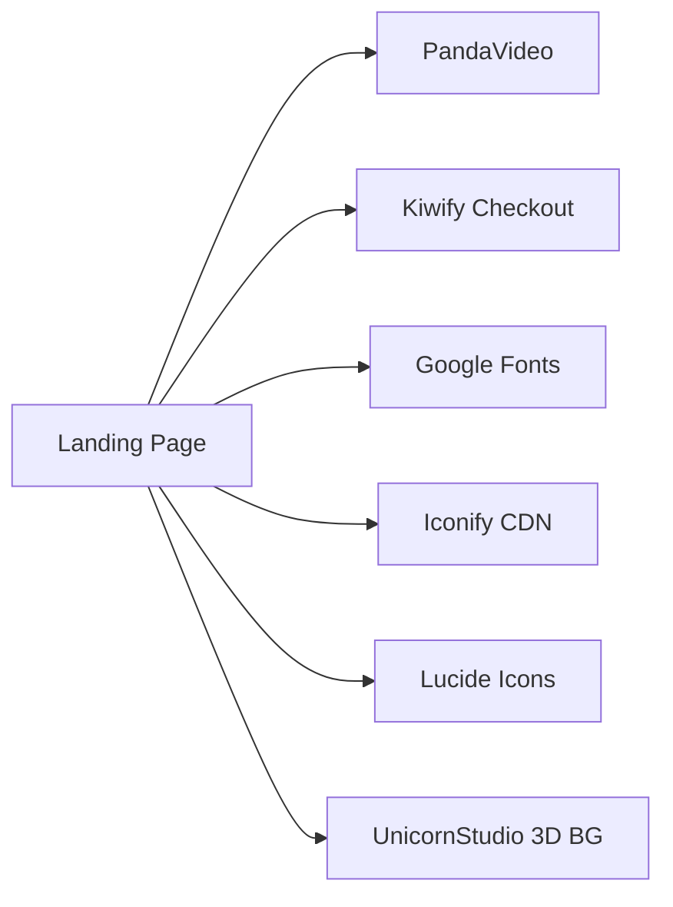
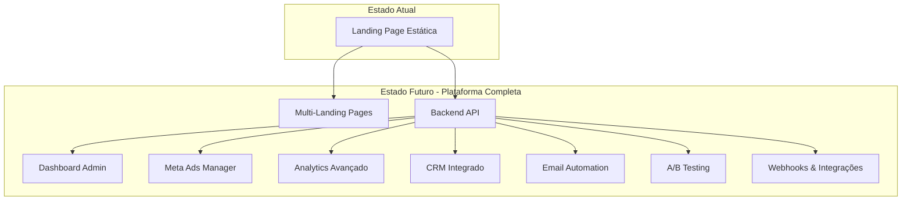
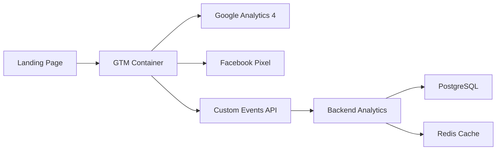
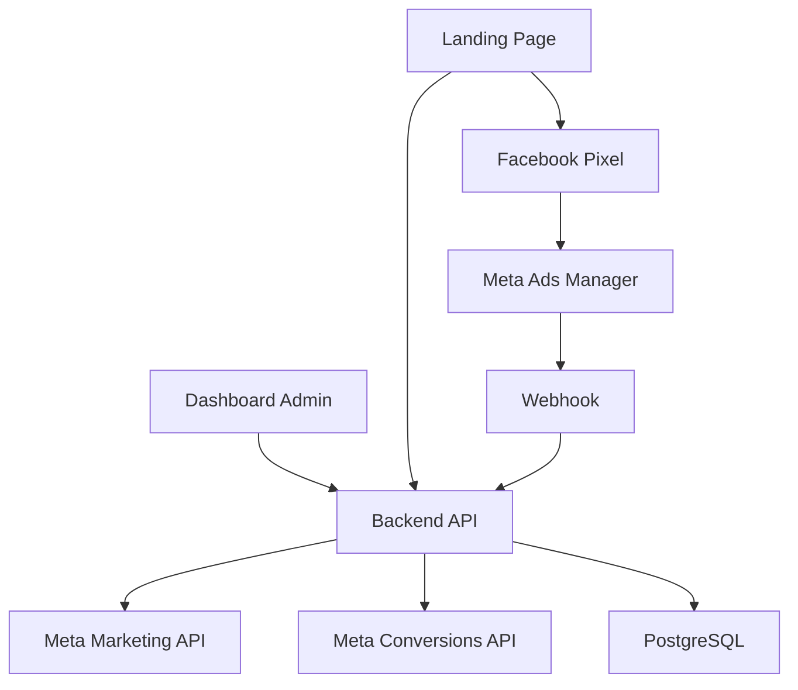

# 📊 Análise de Arquitetura e Plano de Desenvolvimento
## Projeto: Cetose Consciente → Plataforma de Marketing Digital

**Data:** 2026-07-11  
**Versão:** 1.0  
**Status:** Análise Completa

---

## 📋 Sumário Executivo

Este documento apresenta uma análise completa da arquitetura atual do projeto "Cetose Consciente" e propõe um plano de desenvolvimento em 10 módulos para transformá-lo em uma plataforma completa de marketing digital com landing pages, Meta Ads, rastreamento avançado, dashboards e automações.

---

## 🏗️ PARTE 1: ANÁLISE DA ARQUITETURA ATUAL

### 1.1 Estrutura do Projeto

```
Estudo 1/
├── index.html                    # Landing Page Principal (4.088 linhas)
├── info.md                       # Documentação Técnica Completa
│
├── assets/                       # Assets de Produção
│   ├── css/                      # 23 arquivos CSS (Google Fonts)
│   ├── fonts/                    # 48 arquivos de fontes locais
│   ├── img/                      # Imagens otimizadas (WebP, JPEG)
│   ├── js/                       # 3 scripts principais
│   └── glass-effect/             # Componente de efeito glass
│
├── templates/                    # Templates de referência
│   └── design_system2.html
│
├── _dev/                         # Ambiente de Desenvolvimento
│   ├── 3_componentes/            # Biblioteca de componentes
│   ├── glass-pricing/            # Protótipo de preços
│   └── wix.com_studio_*/         # Referências de design
│
└── .agents/                      # Skills de IA (não versionado)
    ├── landing-page-strategist/
    ├── copywriter/
    └── security-specialist/
```

### 1.2 Arquivos Principais Identificados

#### **index.html** (4.088 linhas)
- **Função:** Landing page de vendas do e-book "Cetose Consciente"
- **Tamanho:** ~350KB (HTML + CSS inline)
- **Seções:**
  1. Hero Section com vídeo PandaVideo
  2. Faixa animada de benefícios (marquee)
  3. Seção científica com tabela comparativa
  4. Resultados reais (gráficos de barras)
  5. Prova social (antes/depois)
  6. Oferta (R$ 27,90)
  7. Garantia de 7 dias
  8. Footer

#### **info.md** (398 linhas)
- **Função:** Documentação técnica completa do projeto
- **Conteúdo:**
  - Stack tecnológica
  - Histórico de commits
  - Decisões de arquitetura
  - Varredura de segurança (OWASP Top 10)
  - Registro de sessões de desenvolvimento
  - Pendências e próximas varreduras

### 1.3 Stack Tecnológica Atual

| Camada | Tecnologia | Versão/Detalhes |
|--------|-----------|-----------------|
| **Estrutura** | HTML5 Semântico | Single Page Application |
| **Estilização** | CSS Puro + Tailwind CSS | v3.4.19 (inline no `<head>`) |
| **Tipografia** | Google Fonts | Inter, Manrope, Geist Mono |
| **Ícones** | Lucide Icons + Iconify | CDN |
| **Animações** | CSS Keyframes | fadeSlideIn, marquee, shimmer |
| **Efeitos Visuais** | Glassmorphism, Neon Glow | CSS puro |
| **Tema** | Dark Mode | Paleta Verde Esmeralda (#10b981) |
| **Vídeo** | PandaVideo | Embed com facade pattern |
| **Pagamento** | Kiwify | Link direto (pay.kiwify.com.br) |
| **Controle de Versão** | Git | Branch main |
| **Hospedagem** | GitHub Pages | (inferido) |

### 1.4 Integrações Externas Atuais



**Serviços Identificados:**
1. **PandaVideo** - Hospedagem de vídeo com player customizado
2. **Kiwify** - Gateway de pagamento brasileiro
3. **Google Fonts** - Tipografia (Inter, Manrope, Geist)
4. **Iconify** - Biblioteca de ícones
5. **UnicornStudio** - Background 3D animado

### 1.5 Análise de Segurança (OWASP Top 10)

**Status:** ✅ Aprovado com ressalvas

| Verificação | Status | Observações |
|-------------|--------|-------------|
| XSS (innerHTML, eval) | ✅ Seguro | Não encontrado |
| Formulários | ✅ N/A | Site estático, sem inputs |
| Links externos HTTP | ✅ Seguro | Todos HTTPS |
| Credenciais hardcoded | ✅ Seguro | Não encontrado |
| CSP (Content Security Policy) | ⚠️ Ausente | Recomendado adicionar |
| X-Frame-Options | ⚠️ Ausente | Proteção anti-clickjacking |
| SRI (Subresource Integrity) | ⚠️ Ausente | Scripts locais sem hash |
| Meta lang | ✅ Corrigido | `pt-BR` implementado |

### 1.6 Pontos Fortes da Arquitetura Atual

1. ✅ **Performance Otimizada**
   - CSS inline (reduz requisições HTTP)
   - Imagens em WebP
   - Lazy loading implementado
   - Fontes com preconnect

2. ✅ **Design System Consistente**
   - Paleta de cores definida (Dark + Emerald)
   - Tipografia hierárquica
   - Componentes reutilizáveis
   - Glassmorphism aplicado consistentemente

3. ✅ **Responsividade**
   - Mobile-first approach
   - Media queries isoladas
   - Breakpoints: 640px, 768px, 1024px

4. ✅ **Animações Performáticas**
   - CSS puro (sem JavaScript)
   - Intersection Observer para scroll animations
   - GPU-accelerated transforms

5. ✅ **Documentação Técnica**
   - [`info.md`](info.md) completo e atualizado
   - Histórico de decisões arquiteturais
   - Registro de sessões de desenvolvimento

### 1.7 Pontos de Melhoria Identificados

1. ⚠️ **Monolítico**
   - Todo código em um único arquivo HTML
   - Dificulta manutenção e escalabilidade
   - Sem separação de concerns

2. ⚠️ **Sem Backend**
   - Não há API própria
   - Dependência total de serviços externos
   - Sem banco de dados

3. ⚠️ **Rastreamento Limitado**
   - Sem Google Analytics
   - Sem Facebook Pixel
   - Sem rastreamento de conversões

4. ⚠️ **Sem Automações**
   - Sem email marketing
   - Sem CRM integrado
   - Sem funis automatizados

5. ⚠️ **Gestão Manual**
   - Sem dashboard administrativo
   - Sem métricas em tempo real
   - Sem A/B testing

---

## 🚀 PARTE 2: PLANO DE DESENVOLVIMENTO EM 10 MÓDULOS

### Visão Geral da Transformação



---

## 📦 MÓDULO 1: Fundação Backend & API

### Objetivo
Criar a infraestrutura backend que servirá como base para todos os módulos seguintes.

### Tecnologias Propostas
- **Runtime:** Node.js 20+ com TypeScript
- **Framework:** Express.js ou Fastify
- **Banco de Dados:** PostgreSQL (principal) + Redis (cache)
- **ORM:** Prisma
- **Autenticação:** JWT + Refresh Tokens
- **Validação:** Zod
- **Documentação:** Swagger/OpenAPI

### Estrutura de Diretórios
```
backend/
├── src/
│   ├── config/           # Configurações (DB, env)
│   ├── modules/
│   │   ├── auth/         # Autenticação
│   │   ├── users/        # Gestão de usuários
│   │   ├── leads/        # Gestão de leads
│   │   └── analytics/    # Coleta de eventos
│   ├── shared/
│   │   ├── middleware/   # Auth, CORS, Rate Limit
│   │   ├── utils/        # Helpers
│   │   └── types/        # TypeScript types
│   └── app.ts            # Entry point
├── prisma/
│   └── schema.prisma     # Database schema
└── tests/                # Testes unitários e E2E
```

### Endpoints Principais (MVP)
```typescript
// Autenticação
POST   /api/v1/auth/login
POST   /api/v1/auth/register
POST   /api/v1/auth/refresh
POST   /api/v1/auth/logout

// Leads
POST   /api/v1/leads                    # Capturar lead
GET    /api/v1/leads                    # Listar leads
GET    /api/v1/leads/:id                # Detalhes do lead
PATCH  /api/v1/leads/:id                # Atualizar lead
DELETE /api/v1/leads/:id                # Deletar lead

// Analytics
POST   /api/v1/analytics/events         # Registrar evento
GET    /api/v1/analytics/dashboard      # Métricas gerais
GET    /api/v1/analytics/conversions    # Taxa de conversão

// Landing Pages
GET    /api/v1/pages                    # Listar páginas
POST   /api/v1/pages                    # Criar página
GET    /api/v1/pages/:slug              # Obter página
PATCH  /api/v1/pages/:slug              # Atualizar página
DELETE /api/v1/pages/:slug              # Deletar página
```

### Schema do Banco de Dados (Prisma)
```prisma
// prisma/schema.prisma

model User {
  id            String   @id @default(cuid())
  email         String   @unique
  passwordHash  String
  name          String?
  role          Role     @default(USER)
  createdAt     DateTime @default(now())
  updatedAt     DateTime @updatedAt
  
  pages         Page[]
  campaigns     Campaign[]
}

model Lead {
  id            String   @id @default(cuid())
  email         String
  name          String?
  phone         String?
  source        String?  // utm_source
  medium        String?  // utm_medium
  campaign      String?  // utm_campaign
  pageSlug      String
  status        LeadStatus @default(NEW)
  createdAt     DateTime @default(now())
  updatedAt     DateTime @updatedAt
  
  page          Page     @relation(fields: [pageSlug], references: [slug])
  events        Event[]
}

model Page {
  id            String   @id @default(cuid())
  slug          String   @unique
  title         String
  description   String?
  content       Json     // HTML/JSON content
  isActive      Boolean  @default(true)
  userId        String
  createdAt     DateTime @default(now())
  updatedAt     DateTime @updatedAt
  
  user          User     @relation(fields: [userId], references: [id])
  leads         Lead[]
  events        Event[]
}

model Event {
  id            String   @id @default(cuid())
  type          EventType
  pageSlug      String?
  leadId        String?
  metadata      Json?
  createdAt     DateTime @default(now())
  
  page          Page?    @relation(fields: [pageSlug], references: [slug])
  lead          Lead?    @relation(fields: [leadId], references: [id])
}

enum Role {
  USER
  ADMIN
}

enum LeadStatus {
  NEW
  CONTACTED
  QUALIFIED
  CONVERTED
  LOST
}

enum EventType {
  PAGE_VIEW
  VIDEO_PLAY
  VIDEO_COMPLETE
  CTA_CLICK
  FORM_SUBMIT
  PURCHASE
}
```

### Tarefas do Módulo 1
- [ ] Configurar projeto Node.js + TypeScript
- [ ] Instalar dependências (Express, Prisma, Zod, JWT)
- [ ] Configurar PostgreSQL e Redis
- [ ] Criar schema Prisma e migrations
- [ ] Implementar autenticação JWT
- [ ] Criar endpoints de CRUD para Leads
- [ ] Implementar middleware de rate limiting
- [ ] Configurar CORS e segurança (Helmet)
- [ ] Criar documentação Swagger
- [ ] Escrever testes unitários (Jest)
- [ ] Configurar CI/CD (GitHub Actions)
- [ ] Deploy em ambiente de staging (Railway/Render)

### Critérios de Sucesso
- ✅ API REST funcional com autenticação
- ✅ Banco de dados PostgreSQL configurado
- ✅ Documentação Swagger acessível
- ✅ Cobertura de testes > 80%
- ✅ Deploy automatizado funcionando

---

## 📊 MÓDULO 2: Dashboard Administrativo

### Objetivo
Criar interface web para gestão de leads, páginas e visualização de métricas.

### Tecnologias Propostas
- **Framework:** Next.js 14+ (App Router)
- **UI Library:** shadcn/ui + Tailwind CSS
- **State Management:** Zustand ou React Query
- **Gráficos:** Recharts ou Chart.js
- **Tabelas:** TanStack Table
- **Formulários:** React Hook Form + Zod

### Estrutura de Diretórios
```
dashboard/
├── app/
│   ├── (auth)/
│   │   ├── login/
│   │   └── register/
│   ├── (dashboard)/
│   │   ├── layout.tsx
│   │   ├── page.tsx           # Overview
│   │   ├── leads/
│   │   │   ├── page.tsx       # Lista de leads
│   │   │   └── [id]/page.tsx  # Detalhes do lead
│   │   ├── pages/
│   │   │   ├── page.tsx       # Lista de páginas
│   │   │   ├── new/page.tsx   # Criar página
│   │   │   └── [slug]/page.tsx
│   │   ├── analytics/
│   │   │   └── page.tsx       # Métricas e gráficos
│   │   └── settings/
│   │       └── page.tsx
│   └── api/                   # API Routes (proxy)
├── components/
│   ├── ui/                    # shadcn/ui components
│   ├── charts/                # Componentes de gráficos
│   ├── tables/                # Tabelas reutilizáveis
│   └── forms/                 # Formulários
├── lib/
│   ├── api.ts                 # Cliente API
│   ├── auth.ts                # Helpers de autenticação
│   └── utils.ts
└── types/
    └── index.ts               # TypeScript types
```

### Páginas Principais

#### 1. **Dashboard Overview** (`/dashboard`)
```typescript
// Métricas principais
- Total de Leads (hoje, semana, mês)
- Taxa de Conversão
- Páginas mais visitadas
- Gráfico de leads por dia (últimos 30 dias)
- Últimos leads capturados (tabela)
```

#### 2. **Gestão de Leads** (`/dashboard/leads`)
```typescript
// Funcionalidades
- Tabela com filtros (status, data, página)
- Busca por email/nome
- Exportação CSV
- Ações em massa (marcar como contactado, deletar)
- Detalhes do lead (timeline de eventos)
```

#### 3. **Gestão de Páginas** (`/dashboard/pages`)
```typescript
// Funcionalidades
- Lista de landing pages
- Criar nova página (editor visual ou código)
- Editar página existente
- Ativar/desativar página
- Duplicar página
- Visualizar métricas por página
```

#### 4. **Analytics** (`/dashboard/analytics`)
```typescript
// Métricas avançadas
- Funil de conversão
- Origem de tráfego (UTM)
- Dispositivos (mobile/desktop)
- Navegadores
- Tempo médio na página
- Taxa de rejeição
- Heatmaps (futuro)
```

### Componentes Reutilizáveis

```typescript
// components/charts/LeadsChart.tsx
export function LeadsChart({ data }: { data: LeadData[] }) {
  return (
    <ResponsiveContainer width="100%" height={300}>
      <LineChart data={data}>
        <XAxis dataKey="date" />
        <YAxis />
        <Tooltip />
        <Line type="monotone" dataKey="leads" stroke="#10b981" />
      </LineChart>
    </ResponsiveContainer>
  );
}

// components/tables/LeadsTable.tsx
export function LeadsTable({ leads }: { leads: Lead[] }) {
  const table = useReactTable({
    data: leads,
    columns: [
      { accessorKey: 'email', header: 'Email' },
      { accessorKey: 'name', header: 'Nome' },
      { accessorKey: 'status', header: 'Status' },
      { accessorKey: 'createdAt', header: 'Data' },
    ],
    // ... configuração
  });
  
  return <DataTable table={table} />;
}
```

### Tarefas do Módulo 2
- [ ] Configurar projeto Next.js 14
- [ ] Instalar shadcn/ui e configurar tema
- [ ] Criar layout do dashboard (sidebar + header)
- [ ] Implementar autenticação (NextAuth.js)
- [ ] Criar página de overview com métricas
- [ ] Implementar gestão de leads (CRUD)
- [ ] Criar tabela de leads com filtros
- [ ] Implementar gráficos de analytics
- [ ] Criar formulário de criação de páginas
- [ ] Implementar exportação CSV
- [ ] Adicionar notificações toast
- [ ] Configurar dark mode
- [ ] Otimizar performance (React Query)
- [ ] Deploy em Vercel

### Critérios de Sucesso
- ✅ Dashboard responsivo e funcional
- ✅ Autenticação segura implementada
- ✅ Todas as operações CRUD funcionando
- ✅ Gráficos renderizando corretamente
- ✅ Performance Lighthouse > 90

---

## 🎯 MÓDULO 3: Sistema de Rastreamento Avançado

### Objetivo
Implementar rastreamento completo de eventos, conversões e comportamento do usuário.

### Tecnologias Propostas
- **Google Analytics 4** - Análise de tráfego
- **Google Tag Manager** - Gestão de tags
- **Facebook Pixel** - Rastreamento Meta Ads
- **Hotjar** - Heatmaps e gravações de sessão
- **PostHog** - Analytics open-source (alternativa)

### Arquitetura de Rastreamento



### Eventos a Rastrear

#### **Eventos de Página**
```javascript
// Page View
gtag('event', 'page_view', {
  page_title: 'Cetose Consciente',
  page_location: window.location.href,
  page_path: window.location.pathname
});

// Scroll Depth
gtag('event', 'scroll', {
  percent_scrolled: 25 | 50 | 75 | 100
});

// Time on Page
gtag('event', 'timing_complete', {
  name: 'time_on_page',
  value: 30000, // milliseconds
  event_category: 'engagement'
});
```

#### **Eventos de Vídeo**
```javascript
// Video Play
gtag('event', 'video_start', {
  video_title: 'Cetose Consciente - Vídeo Principal',
  video_provider: 'PandaVideo'
});

// Video Progress
gtag('event', 'video_progress', {
  video_title: 'Cetose Consciente',
  video_percent: 25 | 50 | 75
});

// Video Complete
gtag('event', 'video_complete', {
  video_title: 'Cetose Consciente',
  video_duration: 600 // seconds
});
```

#### **Eventos de Conversão**
```javascript
// CTA Click
gtag('event', 'cta_click', {
  cta_text: 'Quero Acessar Agora',
  cta_location: 'hero' | 'middle' | 'footer'
});

// Form Submit (Lead Capture)
gtag('event', 'generate_lead', {
  currency: 'BRL',
  value: 27.90
});

// Purchase
gtag('event', 'purchase', {
  transaction_id: 'TXN_123456',
  value: 27.90,
  currency: 'BRL',
  items: [{
    item_id: 'ebook_cetose',
    item_name: 'E-book Cetose Consciente',
    price: 27.90,
    quantity: 1
  }]
});
```

### Implementação do GTM

#### **Container GTM** (`gtm-container.html`)
```html
<!-- Google Tag Manager -->
<script>(function(w,d,s,l,i){w[l]=w[l]||[];w[l].push({'gtm.start':
new Date().getTime(),event:'gtm.js'});var f=d.getElementsByTagName(s)[0],
j=d.createElement(s),dl=l!='dataLayer'?'&l='+l:'';j.async=true;j.src=
'https://www.googletagmanager.com/gtm.js?id='+i+dl;f.parentNode.insertBefore(j,f);
})(window,document,'script','dataLayer','GTM-XXXXXXX');</script>
<!-- End Google Tag Manager -->

<!-- Google Tag Manager (noscript) -->
<noscript><iframe src="https://www.googletagmanager.com/ns.html?id=GTM-XXXXXXX"
height="0" width="0" style="display:none;visibility:hidden"></iframe></noscript>
<!-- End Google Tag Manager (noscript) -->
```

#### **Facebook Pixel**
```javascript
// Facebook Pixel Base Code
!function(f,b,e,v,n,t,s)
{if(f.fbq)return;n=f.fbq=function(){n.callMethod?
n.callMethod.apply(n,arguments):n.queue.push(arguments)};
if(!f._fbq)f._fbq=n;n.push=n;n.loaded=!0;n.version='2.0';
n.queue=[];t=b.createElement(e);t.async=!0;
t.src=v;s=b.getElementsByTagName(e)[0];
s.parentNode.insertBefore(t,s)}(window, document,'script',
'https://connect.facebook.net/en_US/fbevents.js');
fbq('init', 'YOUR_PIXEL_ID');
fbq('track', 'PageView');

// Custom Events
fbq('track', 'ViewContent', {
  content_name: 'Cetose Consciente',
  content_category: 'E-book',
  value: 27.90,
  currency: 'BRL'
});

fbq('track', 'AddToCart', {
  content_name: 'E-book Cetose Consciente',
  value: 27.90,
  currency: 'BRL'
});

fbq('track', 'Purchase', {
  value: 27.90,
  currency: 'BRL',
  content_name: 'E-book Cetose Consciente'
});
```

### API de Analytics Customizada

```typescript
// backend/src/modules/analytics/analytics.service.ts

export class AnalyticsService {
  async trackEvent(data: TrackEventDto) {
    const event = await prisma.event.create({
      data: {
        type: data.type,
        pageSlug: data.pageSlug,
        leadId: data.leadId,
        metadata: {
          userAgent: data.userAgent,
          ip: data.ip,
          referrer: data.referrer,
          utm: {
            source: data.utm_source,
            medium: data.utm_medium,
            campaign: data.utm_campaign,
            content: data.utm_content,
            term: data.utm_term
          },
          device: {
            type: data.deviceType,
            os: data.os,
            browser: data.browser
          }
        }
      }
    });
    
    // Atualizar cache Redis
    await this.updateAnalyticsCache(event);
    
    return event;
  }
  
  async getConversionFunnel(pageSlug: string, dateRange: DateRange) {
    const funnel = await prisma.$queryRaw`
      SELECT 
        COUNT(DISTINCT CASE WHEN type = 'PAGE_VIEW' THEN lead_id END) as page_views,
        COUNT(DISTINCT CASE WHEN type = 'VIDEO_PLAY' THEN lead_id END) as video_plays,
        COUNT(DISTINCT CASE WHEN type = 'CTA_CLICK' THEN lead_id END) as cta_clicks,
        COUNT(DISTINCT CASE WHEN type = 'PURCHASE' THEN lead_id END) as purchases
      FROM events
      WHERE page_slug = ${pageSlug}
        AND created_at BETWEEN ${dateRange.start} AND ${dateRange.end}
    `;
    
    return {
      page_views: funnel[0].page_views,
      video_plays: funnel[0].video_plays,
      cta_clicks: funnel[0].cta_clicks,
      purchases: funnel[0].purchases,
      conversion_rate: (funnel[0].purchases / funnel[0].page_views) * 100
    };
  }
}
```

### Tarefas do Módulo 3
- [ ] Criar conta Google Analytics 4
- [ ] Configurar Google Tag Manager
- [ ] Implementar Facebook Pixel
- [ ] Criar eventos customizados (vídeo, CTA, scroll)
- [ ] Implementar API de analytics no backend
- [ ] Criar tabela de eventos no banco
- [ ] Implementar rastreamento de UTM parameters
- [ ] Configurar conversões no Google Ads
- [ ] Configurar conversões no Facebook Ads
- [ ] Implementar Hotjar (heatmaps)
- [ ] Criar relatórios de funil de conversão
- [ ] Testar todos os eventos (GTM Preview)
- [ ] Documentar eventos e triggers

### Critérios de Sucesso
- ✅ Google Analytics 4 rastreando corretamente
- ✅ Facebook Pixel disparando eventos
- ✅ Todos os eventos customizados funcionando
- ✅ Funil de conversão visível no dashboard
- ✅ UTM parameters sendo capturados

---

## 📱 MÓDULO 4: Integração com Meta Ads (Facebook/Instagram)

### Objetivo
Criar sistema completo de gestão de campanhas Meta Ads com rastreamento de conversões e otimização automática.

### Tecnologias Propostas
- **Meta Marketing API** - Gestão de campanhas
- **Meta Conversions API** - Rastreamento server-side
- **Facebook Business SDK** - Node.js
- **Webhook Receiver** - Notificações em tempo real

### Arquitetura de Integração



### Estrutura de Campanhas

```typescript
// Hierarquia Meta Ads
Campaign (Campanha)
  └── Ad Set (Conjunto de Anúncios)
      └── Ad (Anúncio)
          └── Creative (Criativo)

// Exemplo de estrutura
{
  campaign: {
    name: "Cetose Consciente - Conversão",
    objective: "OUTCOME_SALES",
    status: "ACTIVE",
    budget: 5000 // R$ 50,00/dia
  },
  adSet: {
    name: "Público Interessado em Dieta Keto",
    targeting: {
      age_min: 25,
      age_max: 55,
      genders: [1, 2],
      geo_locations: {
        countries: ["BR"],
        regions: [{ key: "3462" }] // São Paulo
      },
      interests: [
        { id: "6003139266461", name: "Ketogenic diet" },
        { id: "6003107902433", name: "Weight loss" }
      ]
    },
    optimization_goal: "OFFSITE_CONVERSIONS",
