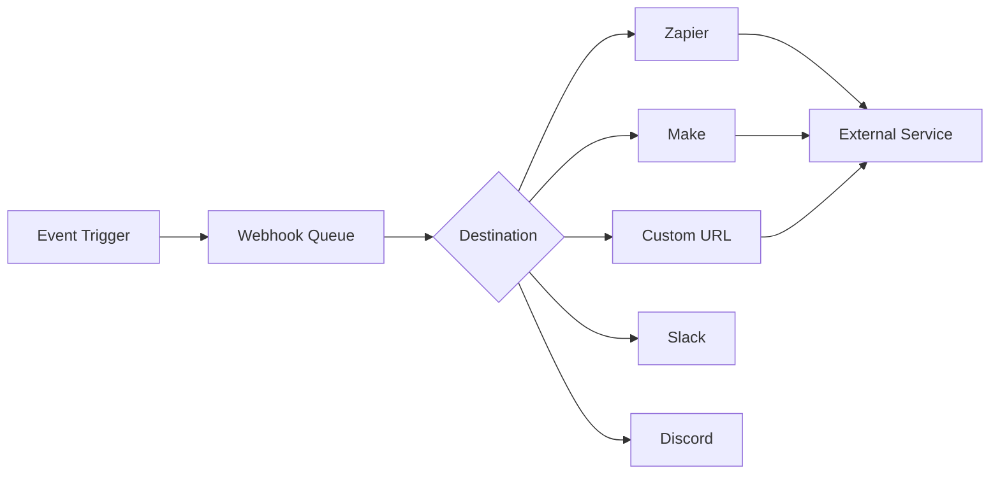
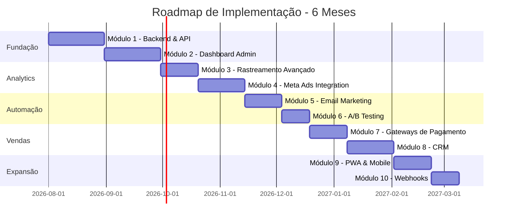
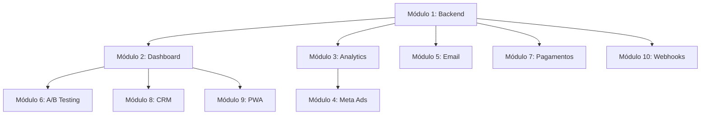

# 📦 MÓDULOS 7-10 E CONCLUSÃO DO PLANO
## Continuação: Plataforma de Marketing Digital Completa

---

## 💳 MÓDULO 7: Integração com Gateways de Pagamento

### Objetivo
Integrar múltiplos gateways de pagamento com rastreamento de transações e webhooks.

### Tecnologias Propostas
- **Kiwify** - Gateway atual (manter)
- **Stripe** - Pagamentos internacionais
- **Mercado Pago** - Alternativa brasileira
- **Hotmart** - Marketplace de infoprodutos

### Endpoints de Pagamento

```typescript
// Criar checkout
POST /api/v1/payments/checkout
Body: {
  gateway: "stripe" | "kiwify" | "mercadopago",
  leadId: "lead_123",
  email: "user@example.com"
}

// Webhook handlers
POST /api/v1/webhooks/stripe
POST /api/v1/webhooks/kiwify
POST /api/v1/webhooks/mercadopago

// Listar transações
GET /api/v1/payments/transactions
Query: { status, dateFrom, dateTo, gateway }

// Detalhes da transação
GET /api/v1/payments/transactions/:id

// Reembolso
POST /api/v1/payments/transactions/:id/refund
```

### Tarefas do Módulo 7
- [ ] Integrar Stripe SDK
- [ ] Integrar Mercado Pago SDK
- [ ] Criar serviço unificado de pagamentos
- [ ] Implementar webhooks para cada gateway
- [ ] Criar sistema de retry para webhooks falhados
- [ ] Implementar reconciliação de pagamentos
- [ ] Criar relatório de transações
- [ ] Implementar sistema de reembolso
- [ ] Configurar notificações de pagamento
- [ ] Testar fluxo completo de cada gateway
- [ ] Documentar integração de cada gateway

### Critérios de Sucesso
- ✅ 3 gateways integrados e funcionais
- ✅ Webhooks processando corretamente
- ✅ Taxa de sucesso de pagamento > 95%
- ✅ Reconciliação automática funcionando
- ✅ Reembolsos processados em < 24h

---

## 🤖 MÓDULO 8: CRM e Gestão de Relacionamento

### Objetivo
Criar sistema CRM para gestão completa do relacionamento com leads e clientes.

### Tecnologias Propostas
- **Custom CRM** - Solução própria
- **Integração Pipedrive** - CRM externo (opcional)
- **WhatsApp Business API** - Comunicação direta
- **Twilio** - SMS e chamadas

### Funcionalidades do CRM

#### **1. Pipeline de Vendas**
```typescript
Stages:
1. Novo Lead (NEW)
2. Contactado (CONTACTED)
3. Qualificado (QUALIFIED)
4. Proposta Enviada (PROPOSAL_SENT)
5. Negociação (NEGOTIATION)
6. Ganho (WON)
7. Perdido (LOST)
```

#### **2. Timeline de Atividades**
```typescript
Activities:
- Email enviado
- Email aberto
- Link clicado
- Vídeo assistido
- CTA clicado
- Compra realizada
- Nota adicionada
- Tarefa criada
- Ligação realizada
```

#### **3. Segmentação Avançada**
```typescript
Segments:
- Por comportamento (engajamento alto/médio/baixo)
- Por fonte (Facebook, Google, Orgânico)
- Por produto de interesse
- Por valor de compra
- Por localização
- Por dispositivo
- Custom segments (queries SQL)
```

### Schema do CRM

```prisma
model Lead {
  id            String   @id @default(cuid())
  email         String   @unique
  name          String?
  phone         String?
  stage         LeadStage @default(NEW)
  score         Int      @default(0)
  tags          String[]
  customFields  Json?
  assignedTo    String?
  createdAt     DateTime @default(now())
  updatedAt     DateTime @updatedAt
  
  activities    Activity[]
  notes         Note[]
  tasks         Task[]
  deals         Deal[]
}

model Activity {
  id            String   @id @default(cuid())
  type          ActivityType
  leadId        String
  userId        String?
  metadata      Json?
  createdAt     DateTime @default(now())
  
  lead          Lead     @relation(fields: [leadId], references: [id])
  user          User?    @relation(fields: [userId], references: [id])
}

model Note {
  id            String   @id @default(cuid())
  content       String
  leadId        String
  userId        String
  createdAt     DateTime @default(now())
  
  lead          Lead     @relation(fields: [leadId], references: [id])
  user          User     @relation(fields: [userId], references: [id])
}

model Task {
  id            String   @id @default(cuid())
  title         String
  description   String?
  leadId        String
  userId        String
  dueDate       DateTime
  completed     Boolean  @default(false)
  createdAt     DateTime @default(now())
  
  lead          Lead     @relation(fields: [leadId], references: [id])
  user          User     @relation(fields: [userId], references: [id])
}

model Deal {
  id            String   @id @default(cuid())
  title         String
  value         Float
  stage         DealStage
  leadId        String
  userId        String
  expectedCloseDate DateTime?
  closedAt      DateTime?
  createdAt     DateTime @default(now())
  
  lead          Lead     @relation(fields: [leadId], references: [id])
  user          User     @relation(fields: [userId], references: [id])
}

enum LeadStage {
  NEW
  CONTACTED
  QUALIFIED
  PROPOSAL_SENT
  NEGOTIATION
  WON
  LOST
}

enum ActivityType {
  EMAIL_SENT
  EMAIL_OPENED
  LINK_CLICKED
  VIDEO_WATCHED
  CTA_CLICKED
  PURCHASE
  NOTE_ADDED
  TASK_CREATED
  CALL_MADE
  WHATSAPP_SENT
}

enum DealStage {
  PROSPECTING
  QUALIFICATION
  PROPOSAL
  NEGOTIATION
  CLOSED_WON
  CLOSED_LOST
}
```

### Lead Scoring Automático

```typescript
// backend/src/modules/crm/lead-scoring.service.ts

export class LeadScoringService {
  async calculateScore(leadId: string): Promise<number> {
    const lead = await prisma.lead.findUnique({
      where: { id: leadId },
      include: { activities: true }
    });
    
    let score = 0;
    
    // Pontuação por atividade
    const activityScores = {
      EMAIL_OPENED: 5,
      LINK_CLICKED: 10,
      VIDEO_WATCHED: 15,
      CTA_CLICKED: 25,
      PURCHASE: 100
    };
    
    for (const activity of lead.activities) {
      score += activityScores[activity.type] || 0;
    }
    
    // Pontuação por recência (últimos 7 dias = +20 pontos)
    const daysSinceLastActivity = getDaysSince(lead.updatedAt);
    if (daysSinceLastActivity <= 7) {
      score += 20;
    }
    
    // Pontuação por completude de perfil
    if (lead.name) score += 5;
    if (lead.phone) score += 10;
    
    // Atualizar score no banco
    await prisma.lead.update({
      where: { id: leadId },
      data: { score }
    });
    
    return score;
  }
  
  async getHotLeads(limit: number = 50): Promise<Lead[]> {
    return prisma.lead.findMany({
      where: {
        score: { gte: 50 },
        stage: { in: ['NEW', 'CONTACTED', 'QUALIFIED'] }
      },
      orderBy: { score: 'desc' },
      take: limit
    });
  }
}
```

### Integração WhatsApp Business

```typescript
// backend/src/modules/crm/whatsapp.service.ts

import { Client } from 'whatsapp-web.js';

export class WhatsAppService {
  private client: Client;
  
  constructor() {
    this.client = new Client({
      authStrategy: new LocalAuth()
    });
    
    this.client.on('ready', () => {
      console.log('WhatsApp Client is ready!');
    });
    
    this.client.initialize();
  }
  
  async sendMessage(phone: string, message: string) {
    const chatId = `55${phone}@c.us`; // Formato brasileiro
    
    await this.client.sendMessage(chatId, message);
    
    // Registrar atividade
    await prisma.activity.create({
      data: {
        type: 'WHATSAPP_SENT',
        leadId: await this.getLeadIdByPhone(phone),
        metadata: { message }
      }
    });
  }
  
  async sendTemplate(phone: string, template: string, variables: any) {
    const message = this.renderTemplate(template, variables);
    await this.sendMessage(phone, message);
  }
}
```

### Tarefas do Módulo 8
- [ ] Criar schema completo do CRM
- [ ] Implementar pipeline de vendas
- [ ] Criar timeline de atividades
- [ ] Implementar lead scoring automático
- [ ] Criar sistema de segmentação
- [ ] Implementar gestão de tarefas
- [ ] Criar sistema de notas
- [ ] Integrar WhatsApp Business API
- [ ] Criar interface de CRM no dashboard
- [ ] Implementar filtros avançados
- [ ] Criar relatórios de vendas
- [ ] Implementar notificações de tarefas

### Critérios de Sucesso
- ✅ CRM completo e funcional
- ✅ Lead scoring calculado automaticamente
- ✅ Pipeline visual e intuitivo
- ✅ WhatsApp integrado e funcionando
- ✅ Tempo de resposta < 2 horas

---

## 📱 MÓDULO 9: Progressive Web App (PWA) e Mobile

### Objetivo
Transformar a plataforma em PWA e criar experiência mobile otimizada.

### Tecnologias Propostas
- **Next.js PWA** - Service Workers
- **Workbox** - Estratégias de cache
- **Push Notifications** - Web Push API
- **React Native** (futuro) - App nativo

### Funcionalidades PWA

#### **1. Instalação**
```typescript
// Permitir instalação no dispositivo
- Ícone na home screen
- Splash screen customizada
- Modo standalone (sem barra do navegador)
```

#### **2. Offline First**
```typescript
// Estratégias de cache
- Cache First: Assets estáticos (CSS, JS, imagens)
- Network First: API calls com fallback
- Stale While Revalidate: Dados que podem ser desatualizados
```

#### **3. Push Notifications**
```typescript
// Notificações push
- Novo lead capturado
- Pagamento recebido
- Tarefa vencendo
- Meta de vendas atingida
```

### Implementação do Service Worker

```typescript
// public/sw.js

import { precacheAndRoute } from 'workbox-precaching';
import { registerRoute } from 'workbox-routing';
import { CacheFirst, NetworkFirst, StaleWhileRevalidate } from 'workbox-strategies';
import { ExpirationPlugin } from 'workbox-expiration';

// Precache de assets estáticos
precacheAndRoute(self.__WB_MANIFEST);

// Cache de imagens
registerRoute(
  ({ request }) => request.destination === 'image',
  new CacheFirst({
    cacheName: 'images',
    plugins: [
      new ExpirationPlugin({
        maxEntries: 60,
        maxAgeSeconds: 30 * 24 * 60 * 60, // 30 dias
      }),
    ],
  })
);

// Cache de API calls
registerRoute(
  ({ url }) => url.pathname.startsWith('/api/'),
  new NetworkFirst({
    cacheName: 'api-cache',
    plugins: [
      new ExpirationPlugin({
        maxEntries: 50,
        maxAgeSeconds: 5 * 60, // 5 minutos
      }),
    ],
  })
);

// Push notifications
self.addEventListener('push', (event) => {
  const data = event.data.json();
  
  const options = {
    body: data.body,
    icon: '/icon-192x192.png',
    badge: '/badge-72x72.png',
    vibrate: [100, 50, 100],
    data: {
      url: data.url
    }
  };
  
  event.waitUntil(
    self.registration.showNotification(data.title, options)
  );
});

self.addEventListener('notificationclick', (event) => {
  event.notification.close();
  event.waitUntil(
    clients.openWindow(event.notification.data.url)
  );
});
```

### Manifest.json

```json
{
  "name": "Cetose Consciente - Dashboard",
  "short_name": "Cetose",
  "description": "Plataforma de gestão de marketing digital",
  "start_url": "/dashboard",
  "display": "standalone",
  "background_color": "#000000",
  "theme_color": "#10b981",
  "orientation": "portrait-primary",
  "icons": [
    {
      "src": "/icon-72x72.png",
      "sizes": "72x72",
      "type": "image/png"
    },
    {
      "src": "/icon-96x96.png",
      "sizes": "96x96",
      "type": "image/png"
    },
    {
      "src": "/icon-128x128.png",
      "sizes": "128x128",
      "type": "image/png"
    },
    {
      "src": "/icon-144x144.png",
      "sizes": "144x144",
      "type": "image/png"
    },
    {
      "src": "/icon-152x152.png",
      "sizes": "152x152",
      "type": "image/png"
    },
    {
      "src": "/icon-192x192.png",
      "sizes": "192x192",
      "type": "image/png"
    },
    {
      "src": "/icon-384x384.png",
      "sizes": "384x384",
      "type": "image/png"
    },
    {
      "src": "/icon-512x512.png",
      "sizes": "512x512",
      "type": "image/png"
    }
  ]
}
```

### Push Notifications Backend

```typescript
// backend/src/modules/notifications/push.service.ts

import webpush from 'web-push';

export class PushNotificationService {
  constructor() {
    webpush.setVapidDetails(
      'mailto:contato@cetoseconsciente.com',
      process.env.VAPID_PUBLIC_KEY,
      process.env.VAPID_PRIVATE_KEY
    );
  }
  
  async subscribe(userId: string, subscription: PushSubscription) {
    await prisma.pushSubscription.create({
      data: {
        userId,
        endpoint: subscription.endpoint,
        keys: subscription.keys
      }
    });
  }
  
  async sendNotification(userId: string, notification: Notification) {
    const subscriptions = await prisma.pushSubscription.findMany({
      where: { userId }
    });
    
    const payload = JSON.stringify({
      title: notification.title,
      body: notification.body,
      url: notification.url,
      icon: '/icon-192x192.png'
    });
    
    const promises = subscriptions.map(sub =>
      webpush.sendNotification(
        {
          endpoint: sub.endpoint,
          keys: sub.keys
        },
        payload
      ).catch(error => {
        // Se falhar, remover subscription inválida
        if (error.statusCode === 410) {
          prisma.pushSubscription.delete({ where: { id: sub.id } });
        }
      })
    );
    
    await Promise.all(promises);
  }
  
  async notifyNewLead(userId: string, lead: Lead) {
    await this.sendNotification(userId, {
      title: '🎉 Novo Lead Capturado!',
      body: `${lead.name || lead.email} acabou de se cadastrar`,
      url: `/dashboard/leads/${lead.id}`
    });
  }
  
  async notifyNewPurchase(userId: string, purchase: Purchase) {
    await this.sendNotification(userId, {
      title: '💰 Nova Venda Realizada!',
      body: `Venda de R$ ${purchase.amount} confirmada`,
      url: `/dashboard/payments/${purchase.id}`
    });
  }
}
```

### Tarefas do Módulo 9
- [ ] Configurar Next.js PWA
- [ ] Criar manifest.json
- [ ] Implementar service worker
- [ ] Configurar estratégias de cache
- [ ] Criar ícones em todos os tamanhos
- [ ] Implementar push notifications
- [ ] Criar sistema de subscrição
- [ ] Otimizar para mobile (touch, gestos)
- [ ] Implementar modo offline
- [ ] Testar instalação em iOS e Android
- [ ] Configurar splash screens
- [ ] Otimizar performance (Lighthouse > 95)

### Critérios de Sucesso
- ✅ PWA instalável em todos os dispositivos
- ✅ Funciona offline (cache funcionando)
- ✅ Push notifications entregues
- ✅ Performance Lighthouse > 95
- ✅ Experiência mobile fluida

---

## 🔗 MÓDULO 10: Webhooks e Integrações Externas

### Objetivo
Criar sistema de webhooks para integração com ferramentas externas e automações.

### Tecnologias Propostas
- **Zapier** - Automações no-code
- **Make (Integromat)** - Automações avançadas
- **n8n** - Automação open-source
- **Custom Webhooks** - API própria

### Arquitetura de Webhooks



### Eventos Disponíveis para Webhooks

```typescript
WebhookEvents:
- lead.created
- lead.updated
- lead.converted
- payment.completed
- payment.failed
- payment.refunded
- email.sent
- email.opened
- email.clicked
- campaign.started
- campaign.completed
- experiment.winner_declared
```

### Implementação do Sistema de Webhooks

```typescript
// backend/src/modules/webhooks/webhook.service.ts

export class WebhookService {
  private queue: Queue;
  
  constructor() {
    this.queue = new Queue('webhooks', {
      redis: process.env.REDIS_URL
    });
    
    this.processQueue();
  }
  
  async registerWebhook(data: RegisterWebhookDto) {
    const webhook = await prisma.webhook.create({
      data: {
        url: data.url,
        events: data.events,
        secret: this.generateSecret(),
        userId: data.userId,
        isActive: true
      }
    });
    
    return webhook;
  }
  
  async triggerEvent(event: string, payload: any) {
    // Buscar webhooks que escutam este evento
    const webhooks = await prisma.webhook.findMany({
      where: {
        events: { has: event },
        isActive: true
      }
    });
    
    // Adicionar à fila
    for (const webhook of webhooks) {
      await this.queue.add('send', {
        webhookId: webhook.id,
        url: webhook.url,
        event,
        payload,
        secret: webhook.secret
      });
    }
  }
  
  private processQueue() {
    this.queue.process('send', async (job) => {
      const { webhookId, url, event, payload, secret } = job.data;
      
      const signature = this.generateSignature(payload, secret);
      
      try {
        const response = await fetch(url, {
          method: 'POST',
          headers: {
            'Content-Type': 'application/json',
            'X-Webhook-Signature': signature,
            'X-Webhook-Event': event
          },
          body: JSON.stringify(payload)
        });
        
        // Registrar entrega
        await prisma.webhookDelivery.create({
          data: {
            webhookId,
            event,
            statusCode: response.status,
            success: response.ok,
            responseBody: await response.text()
          }
        });
        
        return { success: true };
      } catch (error) {
        // Retry com backoff exponencial
        if (job.attemptsMade < 3) {
          throw error; // Bull vai fazer retry
        }
        
        // Após 3 tentativas, marcar como falha
        await prisma.webhookDelivery.create({
          data: {
            webhookId,
            event,
            success: false,
            error: error.message
          }
        });
      }
    });
  }
  
  private generateSignature(payload: any, secret: string): string {
    const hmac = crypto.createHmac('sha256', secret);
    hmac.update(JSON.stringify(payload));
    return hmac.digest('hex');
  }
  
  private generateSecret(): string {
    return crypto.randomBytes(32).toString('hex');
  }
}
```

### Integrações Pré-Configuradas

#### **1. Zapier Integration**
```typescript
// Triggers disponíveis no Zapier
- New Lead
- New Purchase
- Email Opened
- Campaign Completed

// Actions disponíveis
- Create Lead
- Update Lead Status
- Send Email
- Create Campaign
```

#### **2. Slack Notifications**
```typescript
// backend/src/modules/integrations/slack.service.ts

export class SlackService {
  async sendNotification(channel: string, message: string) {
    await fetch(process.env.SLACK_WEBHOOK_URL, {
      method: 'POST',
      headers: { 'Content-Type': 'application/json' },
      body: JSON.stringify({
        channel,
        text: message,
        username: 'Cetose Bot',
        icon_emoji: ':rocket:'
      })
    });
  }
  
  async notifyNewLead(lead: Lead) {
    const message = `
🎉 *Novo Lead Capturado!*
Nome: ${lead.name || 'Não informado'}
Email: ${lead.email}
Fonte: ${lead.source || 'Desconhecida'}
<https://dashboard.cetoseconsciente.com/leads/${lead.id}|Ver Detalhes>
    `;
    
    await this.sendNotification('#vendas', message);
  }
  
  async notifyNewPurchase(purchase: Purchase) {
    const message = `
💰 *Nova Venda Realizada!*
Valor: R$ ${purchase.amount}
Cliente: ${purchase.lead.email}
Gateway: ${purchase.gateway}
<https://dashboard.cetoseconsciente.com/payments/${purchase.id}|Ver Transação>
    `;
    
    await this.sendNotification('#vendas', message);
  }
}
```

#### **3. Google Sheets Integration**
```typescript
// Exportar leads para Google Sheets automaticamente

import { google } from 'googleapis';

export class GoogleSheetsService {
  private sheets: any;
  
  constructor() {
    const auth = new google.auth.GoogleAuth({
      keyFile: process.env.GOOGLE_CREDENTIALS_PATH,
      scopes: ['https://www.googleapis.com/auth/spreadsheets']
    });
    
    this.sheets = google.sheets({ version: 'v4', auth });
  }
  
  async exportLead(lead: Lead) {
    await this.sheets.spreadsheets.values.append({
      spreadsheetId: process.env.GOOGLE_SHEET_ID,
      range: 'Leads!A:F',
      valueInputOption: 'USER_ENTERED',
      resource: {
        values: [[
          lead.email,
          lead.name,
          lead.phone,
          lead.source,
          lead.status,
          lead.createdAt.toISOString()
        ]]
      }
    });
  }
}
```

### Endpoints de Webhooks

```typescript
// Registrar webhook
POST /api/v1/webhooks
Body: {
  url: "https://hooks.zapier.com/...",
  events: ["lead.created", "payment.completed"],
  description: "Zapier Integration"
}

// Listar webhooks
GET /api/v1/webhooks

// Atualizar webhook
PATCH /api/v1/webhooks/:id
Body: {
  events: ["lead.created"],
  isActive: false
}

// Deletar webhook
DELETE /api/v1/webhooks/:id

// Histórico de entregas
GET /api/v1/webhooks/:id/deliveries
Query: { status, dateFrom, dateTo }

// Reenviar webhook
POST /api/v1/webhooks/deliveries/:id/retry
```

### Tarefas do Módulo 10
- [ ] Criar schema de webhooks no banco
- [ ] Implementar sistema de registro de webhooks
- [ ] Criar fila de processamento (Bull)
- [ ] Implementar retry com backoff exponencial
- [ ] Criar sistema de assinatura (HMAC)
- [ ] Implementar integração com Zapier
- [ ] Criar integração com Slack
- [ ] Implementar integração com Google Sheets
- [ ] Criar interface de gestão de webhooks
- [ ] Implementar logs de entregas
- [ ] Criar documentação de API para webhooks
- [ ] Testar todos os eventos

### Critérios de Sucesso
- ✅ Sistema de webhooks funcional
- ✅ Retry automático funcionando
- ✅ Integração com Zapier ativa
- ✅ Slack recebendo notificações
- ✅ Taxa de entrega > 99%

---

## 🎯 PARTE 3: ROADMAP DE IMPLEMENTAÇÃO

### Cronograma Sugerido



### Fases de Implementação

#### **FASE 1: Fundação (Meses 1-2)**
- ✅ Módulo 1: Backend & API
- ✅ Módulo 2: Dashboard Administrativo
- **Objetivo:** Ter infraestrutura básica funcionando
- **Entregável:** Dashboard com gestão de leads

#### **FASE 2: Analytics (Mês 3)**
- ✅ Módulo 3: Rastreamento Avançado
- ✅ Módulo 4: Meta Ads Integration
- **Objetivo:** Rastrear e otimizar campanhas
- **Entregável:** Funil de conversão completo

#### **FASE 3: Automação (Mês 4)**
- ✅ Módulo 5: Email Marketing
- ✅ Módulo 6: A/B Testing
- **Objetivo:** Automatizar comunicação e otimizar conversões
- **Entregável:** Sequências de email automatizadas

#### **FASE 4: Vendas (Mês 5)**
- ✅ Módulo 7: Gateways de Pagamento
- ✅ Módulo 8: CRM
- **Objetivo:** Processar vendas e gerenciar relacionamento
- **Entregável:** Sistema de vendas completo

#### **FASE 5: Expansão (Mês 6)**
- ✅ Módulo 9: PWA & Mobile
- ✅ Módulo 10: Webhooks
- **Objetivo:** Expandir alcance e integrações
- **Entregável:** Plataforma completa e integrada

### Dependências Entre Módulos



---

## 📊 PARTE 4: MÉTRICAS E KPIs

### KPIs por Módulo

#### **Módulo 1: Backend & API**
- Uptime: > 99.9%
- Response Time: < 200ms (p95)
- Error Rate: < 0.1%
- API