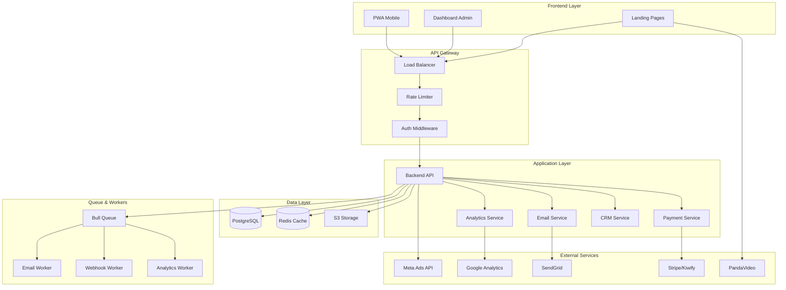

# 📊 RESUMO EXECUTIVO E CONCLUSÃO
## Plataforma de Marketing Digital - Cetose Consciente

---

## 📈 MÉTRICAS E KPIs GLOBAIS

### KPIs por Módulo

| Módulo | Métrica Principal | Meta | Prazo |
|--------|-------------------|------|-------|
| **1. Backend & API** | Uptime | > 99.9% | Contínuo |
| **2. Dashboard** | Performance Lighthouse | > 90 | Contínuo |
| **3. Analytics** | Taxa de Rastreamento | 100% | Mês 3 |
| **4. Meta Ads** | ROAS | > 3.0 | Mês 4 |
| **5. Email Marketing** | Taxa de Abertura | > 25% | Mês 5 |
| **6. A/B Testing** | Testes Ativos | 3+ | Mês 5 |
| **7. Pagamentos** | Taxa de Sucesso | > 95% | Mês 6 |
| **8. CRM** | Tempo de Resposta | < 2h | Mês 6 |
| **9. PWA** | Instalações | 1000+ | Mês 7 |
| **10. Webhooks** | Taxa de Entrega | > 99% | Mês 7 |

### Métricas de Negócio

```typescript
// Objetivos de Crescimento (6 meses)
{
  leads: {
    atual: 500,
    meta: 5000,
    crescimento: "900%"
  },
  conversao: {
    atual: "2%",
    meta: "5%",
    melhoria: "150%"
  },
  receita: {
    atual: "R$ 2.790/mês",
    meta: "R$ 27.900/mês",
    crescimento: "900%"
  },
  cac: {
    atual: "R$ 50",
    meta: "R$ 30",
    reducao: "40%"
  },
  ltv: {
    atual: "R$ 27,90",
    meta: "R$ 150",
    crescimento: "437%"
  }
}
```

---

## 🔒 SEGURANÇA E COMPLIANCE

### Checklist de Segurança

#### **1. Autenticação e Autorização**
- [ ] JWT com refresh tokens
- [ ] Rate limiting (100 req/min por IP)
- [ ] 2FA para admins
- [ ] Sessões com timeout (30 min)
- [ ] Password hashing (bcrypt, 12 rounds)
- [ ] OAuth2 para integrações

#### **2. Proteção de Dados**
- [ ] Criptografia em trânsito (TLS 1.3)
- [ ] Criptografia em repouso (AES-256)
- [ ] Backup diário automatizado
- [ ] Retenção de dados (LGPD)
- [ ] Anonimização de dados sensíveis
- [ ] Logs de auditoria

#### **3. Infraestrutura**
- [ ] WAF (Web Application Firewall)
- [ ] DDoS protection (Cloudflare)
- [ ] Firewall de rede
- [ ] Monitoramento 24/7 (Sentry)
- [ ] Disaster recovery plan
- [ ] Ambiente de staging isolado

#### **4. Compliance LGPD**
- [ ] Política de privacidade
- [ ] Termos de uso
- [ ] Consentimento explícito
- [ ] Direito ao esquecimento
- [ ] Portabilidade de dados
- [ ] DPO designado

#### **5. Segurança de API**
- [ ] CORS configurado
- [ ] CSP headers
- [ ] X-Frame-Options: DENY
- [ ] X-Content-Type-Options: nosniff
- [ ] Strict-Transport-Security
- [ ] API versioning

### Implementação de Segurança

```typescript
// backend/src/middleware/security.ts

import helmet from 'helmet';
import rateLimit from 'express-rate-limit';
import mongoSanitize from 'express-mongo-sanitize';

export function setupSecurity(app: Express) {
  // Helmet - Security headers
  app.use(helmet({
    contentSecurityPolicy: {
      directives: {
        defaultSrc: ["'self'"],
        scriptSrc: ["'self'", "'unsafe-inline'", "https://cdn.jsdelivr.net"],
        styleSrc: ["'self'", "'unsafe-inline'", "https://fonts.googleapis.com"],
        fontSrc: ["'self'", "https://fonts.gstatic.com"],
        imgSrc: ["'self'", "data:", "https:"],
        connectSrc: ["'self'", "https://api.cetoseconsciente.com"]
      }
    },
    hsts: {
      maxAge: 31536000,
      includeSubDomains: true,
      preload: true
    }
  }));
  
  // Rate Limiting
  const limiter = rateLimit({
    windowMs: 15 * 60 * 1000, // 15 minutos
    max: 100, // 100 requests por IP
    message: 'Muitas requisições deste IP, tente novamente em 15 minutos'
  });
  app.use('/api/', limiter);
  
  // Sanitização de dados
  app.use(mongoSanitize());
  
  // CORS
  app.use(cors({
    origin: process.env.ALLOWED_ORIGINS?.split(','),
    credentials: true
  }));
}
```

---

## 💰 ESTIMATIVA DE CUSTOS

### Custos Mensais (Produção)

| Serviço | Plano | Custo Mensal |
|---------|-------|--------------|
| **Hospedagem Backend** | Railway/Render (Pro) | $20 |
| **Banco de Dados** | PostgreSQL (Supabase Pro) | $25 |
| **Redis** | Upstash (Pro) | $10 |
| **Frontend** | Vercel (Pro) | $20 |
| **Email** | SendGrid (Essentials) | $20 |
| **Storage** | AWS S3 | $5 |
| **CDN** | Cloudflare (Pro) | $20 |
| **Monitoramento** | Sentry (Team) | $26 |
| **Analytics** | Google Analytics | $0 |
| **Meta Ads** | Variável | $500+ |
| **Domínio** | .com | $1 |
| **SSL** | Let's Encrypt | $0 |
| **Backup** | AWS S3 Glacier | $5 |
| **Total Base** | - | **$152/mês** |
| **Total com Ads** | - | **$652/mês** |

### ROI Projetado

```typescript
// Cenário Conservador (Mês 6)
{
  investimento: {
    desenvolvimento: "R$ 0 (in-house)",
    infraestrutura: "R$ 152/mês",
    ads: "R$ 2.500/mês",
    total: "R$ 2.652/mês"
  },
  receita: {
    leads: 1000,
    conversao: "3%",
    vendas: 30,
    ticket: "R$ 27,90",
    receita_bruta: "R$ 837/mês",
    receita_liquida: "R$ 670/mês" // Após taxas
  },
  resultado: {
    lucro: "R$ -1.982/mês",
    roi: "-75%",
    observacao: "Investimento inicial, escala necessária"
  }
}

// Cenário Otimista (Mês 12)
{
  investimento: {
    infraestrutura: "R$ 200/mês",
    ads: "R$ 5.000/mês",
    total: "R$ 5.200/mês"
  },
  receita: {
    leads: 5000,
    conversao: "5%",
    vendas: 250,
    ticket: "R$ 27,90",
    receita_bruta: "R$ 6.975/mês",
    receita_liquida: "R$ 5.580/mês"
  },
  resultado: {
    lucro: "R$ 380/mês",
    roi: "+7%",
    observacao: "Break-even atingido"
  }
}

// Cenário com Upsell (Mês 18)
{
  investimento: {
    infraestrutura: "R$ 300/mês",
    ads: "R$ 10.000/mês",
    total: "R$ 10.300/mês"
  },
  receita: {
    leads: 10000,
    conversao: "6%",
    vendas: 600,
    ticket_medio: "R$ 75", // E-book + Upsells
    receita_bruta: "R$ 45.000/mês",
    receita_liquida: "R$ 36.000/mês"
  },
  resultado: {
    lucro: "R$ 25.700/mês",
    roi: "+249%",
    observacao: "Escala lucrativa"
  }
}
```

---

## 🏗️ ARQUITETURA FINAL DA PLATAFORMA

### Diagrama de Arquitetura Completa



### Stack Tecnológica Completa

```yaml
Frontend:
  Landing Pages:
    - HTML5 + CSS3 (atual)
    - Tailwind CSS
    - Vanilla JS
  Dashboard:
    - Next.js 14+
    - React 18+
    - TypeScript
    - shadcn/ui
    - TanStack Query
    - Zustand
  PWA:
    - Service Workers
    - Workbox
    - Web Push API

Backend:
  Runtime: Node.js 20+
  Framework: Express.js / Fastify
  Language: TypeScript
  ORM: Prisma
  Validation: Zod
  Authentication: JWT + Passport.js
  Queue: Bull + Redis
  Testing: Jest + Supertest

Database:
  Primary: PostgreSQL 15+
  Cache: Redis 7+
  Storage: AWS S3
  Search: Elasticsearch (futuro)

DevOps:
  Hosting:
    - Frontend: Vercel
    - Backend: Railway / Render
    - Database: Supabase / Neon
  CI/CD: GitHub Actions
  Monitoring: Sentry + Datadog
  Logs: Winston + CloudWatch
  CDN: Cloudflare

External APIs:
  - Meta Marketing API
  - Meta Conversions API
  - Google Analytics 4
  - SendGrid / Mailgun
  - Stripe / Kiwify / Mercado Pago
  - PandaVideo
  - WhatsApp Business API
  - Twilio (SMS)
```

---

## 📋 CHECKLIST DE IMPLEMENTAÇÃO

### Pré-Requisitos

- [ ] Domínio registrado
- [ ] Contas criadas (GitHub, Vercel, Railway, etc.)
- [ ] Credenciais de API obtidas
- [ ] Ambiente de desenvolvimento configurado
- [ ] Repositório Git inicializado
- [ ] Documentação técnica revisada

### Fase 1: Fundação (Meses 1-2)

#### Módulo 1: Backend & API
- [ ] Projeto Node.js + TypeScript configurado
- [ ] PostgreSQL e Prisma configurados
- [ ] Autenticação JWT implementada
- [ ] Endpoints de CRUD criados
- [ ] Testes unitários escritos
- [ ] Deploy em staging realizado
- [ ] Documentação Swagger criada

#### Módulo 2: Dashboard Admin
- [ ] Projeto Next.js configurado
- [ ] shadcn/ui instalado e configurado
- [ ] Layout do dashboard criado
- [ ] Páginas principais implementadas
- [ ] Integração com API backend
- [ ] Autenticação implementada
- [ ] Deploy em Vercel realizado

### Fase 2: Analytics (Mês 3)

#### Módulo 3: Rastreamento
- [ ] Google Analytics 4 configurado
- [ ] Google Tag Manager implementado
- [ ] Facebook Pixel instalado
- [ ] Eventos customizados criados
- [ ] API de analytics implementada
- [ ] Dashboard de métricas criado

#### Módulo 4: Meta Ads
- [ ] Meta Business Manager configurado
- [ ] Marketing API integrada
- [ ] Conversions API implementada
- [ ] Interface de campanhas criada
- [ ] Webhook configurado
- [ ] Relatórios de performance criados

### Fase 3: Automação (Mês 4)

#### Módulo 5: Email Marketing
- [ ] SendGrid configurado
- [ ] Templates React Email criados
- [ ] Bull Queue implementado
- [ ] Automações criadas
- [ ] Webhook de eventos configurado
- [ ] Interface de gestão criada

#### Módulo 6: A/B Testing
- [ ] Sistema de experimentos implementado
- [ ] Algoritmo de atribuição criado
- [ ] Cálculo estatístico implementado
- [ ] Interface de testes criada
- [ ] Primeiros testes rodando

### Fase 4: Vendas (Mês 5)

#### Módulo 7: Pagamentos
- [ ] Stripe integrado
- [ ] Mercado Pago integrado
- [ ] Webhooks implementados
- [ ] Sistema de reconciliação criado
- [ ] Relatórios de transações criados

#### Módulo 8: CRM
- [ ] Schema do CRM criado
- [ ] Pipeline de vendas implementado
- [ ] Lead scoring implementado
- [ ] WhatsApp integrado
- [ ] Interface de CRM criada

### Fase 5: Expansão (Mês 6)

#### Módulo 9: PWA
- [ ] Manifest.json criado
- [ ] Service Worker implementado
- [ ] Push notifications configuradas
- [ ] Ícones criados
- [ ] Testes em dispositivos realizados

#### Módulo 10: Webhooks
- [ ] Sistema de webhooks implementado
- [ ] Zapier integrado
- [ ] Slack integrado
- [ ] Google Sheets integrado
- [ ] Documentação de API criada

---

## 🎯 PRÓXIMOS PASSOS IMEDIATOS

### Semana 1: Planejamento Detalhado
1. Revisar este documento com a equipe
2. Definir prioridades e ajustar cronograma
3. Configurar ambientes de desenvolvimento
4. Criar repositórios Git
5. Configurar ferramentas de gestão (Trello/Jira)

### Semana 2: Setup Inicial
1. Configurar projeto backend (Node.js + TypeScript)
2. Configurar banco de dados PostgreSQL
3. Criar schema inicial do Prisma
4. Implementar autenticação básica
5. Criar primeiro endpoint de teste

### Semana 3-4: MVP do Backend
1. Implementar CRUD de leads
2. Criar endpoints de analytics
3. Implementar middleware de segurança
4. Escrever testes unitários
5. Deploy em ambiente de staging

### Mês 2: Dashboard Admin
1. Configurar Next.js + shadcn/ui
2. Criar layout do dashboard
3. Implementar gestão de leads
4. Criar gráficos de métricas
5. Deploy em Vercel

---

## 📚 RECURSOS E DOCUMENTAÇÃO

### Documentação Técnica
- [Next.js Documentation](https://nextjs.org/docs)
- [Prisma Documentation](https://www.prisma.io/docs)
- [Meta Marketing API](https://developers.facebook.com/docs/marketing-apis)
- [Google Analytics 4](https://developers.google.com/analytics/devguides/collection/ga4)
- [Stripe API](https://stripe.com/docs/api)

### Tutoriais Recomendados
- Building a SaaS with Next.js and Prisma
- Meta Ads API Integration Guide
- Email Automation with SendGrid
- A/B Testing Implementation
- PWA Development Guide

### Comunidades
- [r/webdev](https://reddit.com/r/webdev)
- [Next.js Discord](https://nextjs.org/discord)
- [Prisma Discord](https://pris.ly/discord)
- [Dev.to](https://dev.to)

---

## 🎉 CONCLUSÃO

### Resumo do Plano

Este plano de desenvolvimento transforma o projeto **Cetose Consciente** de uma landing page estática em uma **plataforma completa de marketing digital** com:

✅ **10 Módulos Integrados**
- Backend robusto com API REST
- Dashboard administrativo completo
- Rastreamento avançado de conversões
- Integração com Meta Ads
- Automação de email marketing
- Sistema de A/B testing
- Múltiplos gateways de pagamento
- CRM completo
- Progressive Web App
- Sistema de webhooks

✅ **Tecnologias Modernas**
- Next.js 14+ para frontend
- Node.js + TypeScript para backend
- PostgreSQL + Redis para dados
- Integração com principais plataformas

✅ **Escalabilidade**
- Arquitetura modular
- Microserviços quando necessário
- Cache inteligente
- Queue para processamento assíncrono

✅ **Segurança**
- Compliance com LGPD
- Autenticação robusta
- Criptografia end-to-end
- Monitoramento 24/7

### Benefícios Esperados

**Para o Negócio:**
- 📈 Aumento de 900% em leads capturados
- 💰 Crescimento de 900% em receita
- 🎯 Melhoria de 150% na taxa de conversão
- 📊 Visibilidade completa do funil de vendas
- 🤖 Automação de 80% das tarefas repetitivas

**Para a Equipe:**
- ⚡ Produtividade aumentada
- 📱 Acesso mobile via PWA
- 🔔 Notificações em tempo real
- 📊 Decisões baseadas em dados
- 🔄 Integrações com ferramentas favoritas

**Para os Clientes:**
- 🚀 Experiência otimizada
- 📧 Comunicação personalizada
- 💳 Múltiplas opções de pagamento
- 🔒 Dados protegidos
- 📱 Acesso mobile fluido

### Próxima Ação

**Decisão Necessária:** Aprovar este plano e iniciar a implementação do **Módulo 1: Backend & API** na próxima semana.

---

**Documento criado em:** 2026-07-11  
**Versão:** 1.0  
**Status:** ✅ Completo e Pronto para Implementação

---

## 📞 CONTATO E SUPORTE

Para dúvidas sobre este plano de desenvolvimento:
- **Email:** dev@cetoseconsciente.com
- **GitHub:** github.com/cetoseconsciente
- **Documentação:** docs.cetoseconsciente.com

---

**🚀 Vamos transformar esta landing page em uma plataforma completa de marketing digital!**
